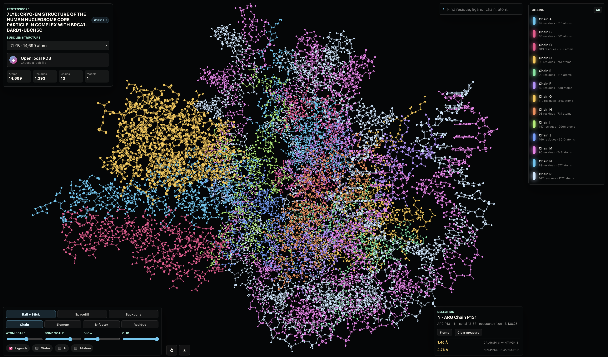

# Proteoscope



Proteoscope is an application for interactive 3D visualization of Protein Data
Bank structures in legacy PDB (`.pdb`) and PDBx/mmCIF (`.cif`, `.mmcif`)
formats. It is written as a single Go binary that embeds the browser UI, static
assets, and bundled structure files, then serves the application on a local URL.

Proteoscope is designed for exploratory structural biology work: load a
structure, inspect chains and ligands, switch molecular representations, color by
scientific properties, view PDBx/mmCIF biological assemblies, search atoms or
residues, measure distances, and export publication-prep screenshots.

## Quick Start: Download A Release

Most users do not need Go installed. Download a prebuilt binary from the
Proteoscope release page:

[https://github.com/robert-mcdermott/proteoscope/releases/tag/v0.2](https://github.com/robert-mcdermott/proteoscope/releases/tag/v0.2)

Choose the file for your operating system:

| Platform | Download |
| --- | --- |
| macOS, Apple Silicon | [`proteoscope-darwin-arm64`](https://github.com/robert-mcdermott/proteoscope/releases/download/v0.3/proteoscope-darwin-arm64) |
| Linux, x64 | [`proteoscope-linux-amd64`](https://github.com/robert-mcdermott/proteoscope/releases/download/v0.3/proteoscope-linux-amd64) |
| Windows, x64 | [`proteoscope-windows-amd64.exe`](https://github.com/robert-mcdermott/proteoscope/releases/download/v0.3/proteoscope-windows-amd64.exe) |

When Proteoscope starts, it prints a local URL, usually:

```text
http://127.0.0.1:8765
```

It will also try to open that URL in your browser. For best performance, open
the URL in Chrome, Edge, or Brave, which have strong WebGPU support. Safari may
fall back to a slower compatibility renderer.

### macOS

Download the macOS binary for your Mac:

Open Terminal and run:

```sh
chmod +x ./proteoscope-darwin-arm64
./proteoscope-darwin-arm64
```

Because the binary is not signed with an Apple developer certificate, macOS may
show a warning such as:

```text
Apple could not verify "proteoscope-darwin-arm64" is free of malware.
```

You can unblock it in either of these ways.

Option 1, from System Settings:

1. Try to open the app once and dismiss the warning.
2. Open `System Settings`.
3. Go to `Privacy & Security`.
4. Scroll to the `Security` section.
5. Click `Open Anyway` for Proteoscope.
6. Confirm by clicking `Open`.

Option 2, from Terminal:

```sh
cd ~/Downloads
xattr -d com.apple.quarantine ./proteoscope-darwin-arm64
chmod +x ./proteoscope-darwin-arm64
./proteoscope-darwin-arm64
```

If `xattr` says the quarantine attribute was not found, continue with the
`chmod` and run commands. Replace the filename with the Intel binary if needed.

### Linux

Download `proteoscope-linux-amd64`, then run:

```sh
cd ~/Downloads
chmod +x ./proteoscope-linux-amd64
./proteoscope-linux-amd64
```

If your browser does not open automatically, copy the printed localhost URL into
Chrome, Edge, Brave, or another WebGPU-capable browser.

### Windows

Download `proteoscope-windows-amd64.exe`, then double-click it.

If Windows SmartScreen blocks the app:

1. Click `More info`.
2. Click `Run anyway`.

If Windows marks the downloaded file as blocked:

1. Right-click `proteoscope-windows-amd64.exe`.
2. Choose `Properties`.
3. On the `General` tab, check `Unblock` if it appears.
4. Click `Apply`.
5. Run the `.exe` again.

You can also run it from PowerShell:

```powershell
.\proteoscope-windows-amd64.exe
```

## Getting Structure Files

Proteoscope reads standard legacy `.pdb` coordinate files and modern
PDBx/mmCIF files ending in `.cif` or `.mmcif`.

You can download more structures from the RCSB PDB download service:

[https://www.rcsb.org/downloads](https://www.rcsb.org/downloads)

The RCSB download page supports downloading multiple files from the PDB archive
and points users to individual data files from each structure's summary page.
For modern RCSB downloads, PDBx/mmCIF (`.cif` or `.mmcif`) is usually the best
choice. Legacy PDB coordinate files (`.pdb`) are also supported. Avoid PDFs,
validation reports, sequence files, compressed archives, and documentation files
unless you decompress or convert them into one of the supported coordinate
formats first.

## Loading Structures

### Bundled Structures

The dropdown labeled `Bundled structure` lists every supported structure file
embedded from the repository's `data/` directory at build time.

To add default structures to your own build:

1. Put one or more `.pdb`, `.cif`, or `.mmcif` files in `data/`.
2. Rebuild the Go binary.
3. The files will be embedded into the executable through Go's embedded
   filesystem.

### Local Uploads

Use `Open local structure` to load a structure from your computer.

The file is parsed in the browser. Proteoscope does not upload local coordinate
files to an external server; the Go process only serves the local application.

## Main Viewer

The central viewport shows the active structure in 3D.

Mouse controls:

- Drag to rotate the molecule.
- Shift-drag to pan.
- Scroll to zoom.
- Click an atom to select it.
- Press `R` to reset the view.
- Press `Esc` to clear search and measurement state.

The renderer badge shows the active rendering mode:

- `WebGPU`: hardware-accelerated rendering is active.
- `Canvas preview`: WebGPU was unavailable in the current browser, so
  Proteoscope is using a compatibility renderer.

For best performance, use a browser with strong WebGPU support. Chrome, Edge,
and Brave work well in current testing. Safari may fall back to a non-WebGPU
path and can feel slower or less responsive with larger structures.

## Structure Summary

The top-left panel shows metadata and counts for the active structure.

The metadata strip reports:

- Coordinate format, such as `PDB` or `PDBx/mmCIF`.
- Experimental method when present.
- Resolution when present.
- Entry ID for deposited structures, or `Local` for files without an entry ID.
- Active assembly, either the asymmetric unit or a selected biological assembly.

### Atoms

For ordinary single-model structures, `Atoms` is the number of atoms in the
loaded model.

For NMR ensembles or other multi-model coordinate files, Proteoscope renders one
model at a time. In that case the UI shows:

- `Atoms/model`: atom count in the currently selected model.
- `Total atoms`: total coordinate records across all models.
- `Models`: number of models available in the file.

For example, an NMR ensemble with 40 models and 619 atoms in each model has
24,760 total coordinate records, but the viewer displays 619 atoms at a time.

### Residues

Residues are grouped by chain, residue name, residue number, and insertion
code. Standard residues, nucleic-acid residues, ligands, and waters are all
recognized from the parsed coordinate records.

### Chains

Chains come from the PDB chain identifier or, for PDBx/mmCIF, the author chain
identifier when present. The chain panel lets you isolate one chain at a time or
return to all chains.

## Representations

Proteoscope provides four molecular representations.

### Ball + Stick

Shows atoms as spheres and bonds as cylinders or ribbons. This is the best
default for inspecting connectivity, ligands, cofactors, and residue-level
geometry.

### Spacefill

Shows atoms closer to their van der Waals size. This emphasizes molecular
volume, steric packing, surface shape, and how tightly ligands or residues fill
space.

### Backbone

Shows a simplified polymer trace. Proteins are traced through alpha carbons
(`CA`), while nucleic acids are traced through backbone atoms such as `P` and
sugar carbons. Ligands remain visible so cofactors and bound molecules are not
lost.

### Cartoon

Shows proteins as a smooth backbone cartoon generated from residue-level
polymer chains. Alpha helices, beta strands, turns, and coils are distinguished
from PDB `HELIX`/`SHEET` records or PDBx/mmCIF `_struct_conf` and
`_struct_sheet_range` annotations when present. If no annotations are available,
Proteoscope uses an approximate C-alpha geometry fallback and labels the source
as computed. Cartoon mode keeps non-protein entities such as ligands, ions,
waters, and nucleic acids available through the existing atom-level rendering
controls.

## Coloring Modes

### Chain

Assigns a different color to each chain. This is useful for complexes,
oligomers, protein-DNA assemblies, and comparing subunits.

### Element

Uses conventional element coloring, such as carbon, nitrogen, oxygen, sulfur,
phosphorus, and common metal ions. This is useful for atom-level chemical
inspection.

### B-factor

Colors atoms by B-factor, also called temperature factor or atomic displacement
parameter. Lower and higher values are mapped to different colors so flexible
or uncertain regions are easier to spot. For NMR files, B-factors may be zero
or less meaningful depending on how the file was deposited.

### Residue

Colors by residue class:

- Hydrophobic residues
- Polar residues
- Positively charged residues
- Negatively charged residues
- Nucleic-acid residues
- Ligands and solvent

This is useful for quickly reading chemical character across a structure.

### Sec Struct

Colors protein cartoons and protein atoms by secondary-structure assignment:
alpha helices, beta strands, turns, and coils. Selection details show whether a
residue's assignment came from file annotation, computed fallback geometry, or
the default coil fallback.

## Display Controls

### Atom Scale

Changes atom sphere size. Increase it for presentations or space-filling
inspection; decrease it when dense structures become visually crowded.

### Bond Scale

Changes bond thickness. Increase it to make connectivity clearer; decrease it
for very large structures.

### Glow

Adds a subtle screen-space glow around atoms. This is a visual aid for depth and
presentation screenshots. Set it lower for a quieter scientific plotting style.

### Clip

Clips the structure along the current viewing direction. This helps inspect the
interior of dense proteins, binding pockets, nucleic-acid grooves, or buried
ligands.

## Visibility Toggles

### Ligands

Shows or hides `HETATM` records that are not water. This usually includes
cofactors, ions, inhibitors, substrates, prosthetic groups, and crystallization
components.

### Water

Shows or hides water molecules such as `HOH`, `WAT`, `H2O`, and `DOD`.

Water is off by default because crystallographic waters can clutter the view,
but turning it on is useful for inspecting active sites, interfaces, and
hydrogen-bonding networks.

### H

Shows or hides hydrogen atoms. Hydrogens are often absent from X-ray structures
and abundant in some NMR or modeled structures, so they are hidden by default.

### Motion

Enables or disables gentle automatic rotation.

## Search

The search box finds residues, ligands, chains, atom names, elements, residue
numbers, and atom serials.

Examples:

- `heme`
- `HEM A142`
- `chain B`
- `lys 42`
- `FE`
- `CA`

Search results include both residue-level and atom-level hits. Selecting a
result focuses the view on that atom or residue representative.

## Selection Panel

Click an atom or choose a search result to select it.

The selection panel reports:

- Atom name
- Residue name and number
- Chain
- Element
- Atom serial number
- Occupancy
- B-factor
- Protein secondary-structure type and assignment source, when applicable

Use `Frame` to center the camera on the selected atom.

## Distance Measurement

Proteoscope supports simple point-to-point distance measurements.

1. Click one atom.
2. Click a second atom.
3. Proteoscope records the distance between them in Angstroms (`Å`).

Each new atom click after the first creates a measurement from the previously
selected atom to the newly selected atom. Measurement lines are drawn in the
viewport and recent measurements appear in the selection panel.

Use `Clear measure` to remove measurement lines and reset the measurement
sequence.

Common uses:

- Ligand-to-residue contact distances
- Metal coordination distances
- Hydrogen-bond candidate distances
- Interface contacts
- Nucleic-acid base-pair or intercalator geometry checks

## Model Slider

Multi-model coordinate files, especially NMR ensembles, show a model slider at
the bottom of the viewport.

Proteoscope displays one model at a time. Move the slider to inspect alternate
conformations in the ensemble.

## Biological Assemblies

PDBx/mmCIF files may define biological assemblies in addition to the deposited
asymmetric unit. When assembly definitions are present, Proteoscope shows a
`Biological assembly` selector in the structure panel.

- `Asymmetric unit` shows the deposited coordinate set.
- Numbered assemblies apply the transformations from the mmCIF assembly records
  and display the generated biological unit.

Proteoscope reads `_pdbx_struct_assembly`, `_pdbx_struct_assembly_gen`, and
`_pdbx_struct_oper_list` for assembly definitions. Operation expressions,
including ranges and Cartesian-product expressions such as `(1-4)(5,6)`, are
resolved into 3D transforms before rendering.

Assembly generation can multiply atom counts dramatically, so Proteoscope uses a
300,000 atoms/model safety limit for generated assemblies. Assemblies above that
limit are shown as unavailable rather than freezing the browser.

## Chain Panel

The chain panel lists all chains detected in the first model. Each row shows:

- Chain identifier
- Residue count
- Atom count
- Chain color

Click any chain row to toggle that chain on or off. You can show any arbitrary
combination of chains, which is useful for comparing interfaces, hiding solvent
or partner chains, or focusing on selected subunits. Press `All` to restore all
chains.

## PNG Export

Use the square toolbar button to export the current viewport as a PNG image.
The image reflects the current camera angle, representation, coloring mode,
visibility toggles, clipping, glow, and selection state.

## Structure Parsing Notes

Proteoscope supports two coordinate formats.

### Legacy PDB

For `.pdb` files, Proteoscope reads these records and fields:

- `HEADER`, `TITLE`, `EXPDTA`, and resolution remarks for metadata.
- `ATOM` and `HETATM` for coordinates and atom properties.
- `MODEL` and `ENDMDL` for multi-model ensembles.
- `HELIX` and `SHEET` for secondary-structure hints.
- `CONECT` for explicit connectivity where present.
- Occupancy, B-factor, element, chain, residue name, residue number, insertion
  code, alternate location, and atom serial fields.

### PDBx/mmCIF

For `.cif` and `.mmcif` files, Proteoscope reads the PDBx/mmCIF categories used
for interactive coordinate viewing:

- `_atom_site` for atom coordinates, element, atom name, residue name, chain,
  sequence ID, insertion code, occupancy, B-factor, model number, and
  `ATOM`/`HETATM` group.
- `_entry`, `_struct`, `_struct_keywords`, `_exptl`, `_refine`,
  `_em_3d_reconstruction`, and `_reflns` for title, entry ID, method,
  classification, keywords, and resolution metadata where present.
- `_struct_conf` and `_struct_sheet_range` for helix and sheet ranges.
- `_struct_conn` for explicit nonstandard links such as ligand, metal,
  disulfide, salt-bridge, or other curated structure connections when those
  records can be matched to rendered atoms.
- `_pdbx_struct_assembly`, `_pdbx_struct_assembly_gen`, and
  `_pdbx_struct_oper_list` for biological assembly generation.

For mmCIF chain display, Proteoscope prefers author-provided chain and residue
identifiers (`auth_*`) when present because they usually match the identifiers
researchers see in publications and RCSB pages. Label identifiers (`label_*`)
are also retained internally for connection matching.

Bond handling:

- Explicit `CONECT` bonds are used when present.
- Explicit `_struct_conn` relationships are used for PDBx/mmCIF files when
  they can be resolved to atom records.
- Standard covalent bonds are inferred from element radii and interatomic
  distance because many coordinate files omit explicit records for ordinary
  polymer residues.

Alternate locations:

- Blank alternate locations are accepted.
- When alternate conformers describe the same atom, Proteoscope chooses the
  highest-occupancy conformer, then `A`/`1`, then the first available conformer.

Limitations:

- Biological assembly generation is currently implemented for PDBx/mmCIF files,
  not legacy PDB `REMARK 350` records.
- Full solvent-accessible surfaces, electrostatics, density maps, and sequence
  annotation tracks are not yet implemented.
- PDBx/mmCIF coordinate, metadata, secondary-structure, and curated connection
  categories are supported; full dictionary coverage is intentionally out of
  scope for the interactive viewer.

## Development

### Requirements

- Go 1.24 or newer.
- A modern browser with WebGPU support. Chrome, Edge, and Brave are recommended
  for best performance. Safari may fall back to a compatibility renderer and is
  not recommended for large structures.

### Run From Source

```sh
go run .
```

Useful flags:

```sh
go run . --no-open
go run . --host 127.0.0.1 --port 8765
```

### Build A Single Binary

```sh
go build -o proteoscope .
```

The resulting executable embeds:

- `web/*`
- supported structure files from `data/`, including `.pdb`, `.cif`, and
  `.mmcif`

That means the app can be distributed as one file.

### Cross Compile

```sh
GOOS=darwin GOARCH=arm64 go build -o dist/proteoscope-darwin-arm64 .
GOOS=darwin GOARCH=amd64 go build -o dist/proteoscope-darwin-amd64 .
GOOS=linux GOARCH=amd64 go build -o dist/proteoscope-linux-amd64 .
GOOS=windows GOARCH=amd64 go build -o dist/proteoscope-windows-amd64.exe .
```

### Test

```sh
go test ./...
node --test web/app.test.mjs
```

There is no Node build step. The frontend is plain embedded HTML, CSS, and
JavaScript.

## Troubleshooting

### The App Opens But Says Canvas Preview

Your browser did not provide a WebGPU device. The app remains usable, but for
the best rendering performance and shading quality, open the localhost URL in a
browser with WebGPU enabled. Chrome, Edge, and Brave are the recommended
choices. Safari may use a fallback path and can perform poorly on larger PDB
files.

### The Port Is Already In Use

Proteoscope tries the requested port first and then searches nearby ports. Use
the URL printed in the terminal.

### My Downloaded File Does Not Load

Make sure the file is a coordinate file ending in `.pdb`, `.cif`, or `.mmcif`.
Some RCSB download options provide compressed archives, validation reports,
sequence files, or PDFs; those are not accepted directly by Proteoscope.

## License

Proteoscope is licensed under the Apache License 2.0. See [LICENSE](LICENSE)
for the full license text.
