# Proteoscope

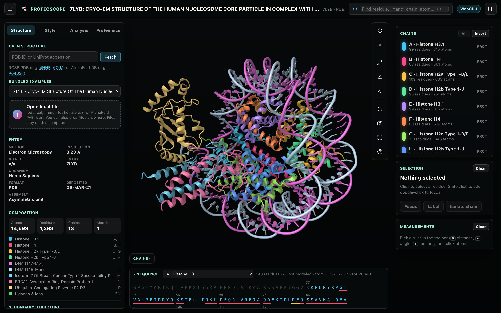

Proteoscope is a 3D viewer and analysis workbench for protein and
nucleic-acid structures, predicted complexes, density maps and structural
proteomics data. It runs on your own computer as one self-contained program:
a single command installs it, and it needs no Python, packages or account.
Parsing, rendering and analysis all happen in your browser, so your files never
leave your machine.

It covers the everyday structural biology loop: find the structures and models
of a protein by gene, name, accession or sequence, or open a file; style it;
find and focus a ligand or residue; see its interactions, surface and
electrostatics; judge model quality (the wwPDB validation report, the density
map, B-factors, AlphaFold pLDDT and PAE, MolProbity-style Ramachandran);
triage the models of AlphaFold 3, Boltz, Chai-1, ColabFold, Protenix and
OpenFold3 runs, or the poses of a docking run; compare it with other
structures, by sequence or by structure alone, or with its AlphaFold
prediction; see which residues evolution conserves; interpret variants with
AlphaMissense; bring in your own mass spectrometry results (search reports
with differential statistics, cross-links, HDX-MS) and public proteomics
evidence; and export a publication-ready figure with a methods paragraph to
go with it.

Highlights:

- **WebGPU renderer.**
  - Ray-cast atoms and bonds with exact intersections.
  - Screen-space ambient occlusion, outlines, depth fog and anti-aliasing.
  - Lighting presets: Standard, Soft, Illustrative, Glossy, Neon and Flat.
  - Interactive at 100k atoms.
- **Representations.**
  - Cartoon with sheet arrows and nucleic-acid bases, ball and stick,
    sticks, spacefill and trace.
  - Molecular, solvent-accessible and Gaussian surfaces with Coulombic
    electrostatics.
  - Double, triple and aromatic bonds from the wwPDB Chemical Component
    Dictionary.
- **Density maps.** The 2Fo-Fc and Fo-Fc maps of X-ray entries and the
  cryo-EM maps of EMDB, through the PDBe volume server, or your own CCP4/MRC
  files: meshes or surfaces around the focus, levels in σ, and the model's
  fit (atom inclusion and per-residue density).
- **Ligands and docking.**
  - Bond orders, aromaticity and charges from the Chemical Component
    Dictionary, used to draw ligands and to type their interactions.
  - Docking poses from AutoDock Vina, smina, GNINA, Glide, GOLD, DOCK, rDock
    or DiffDock (SDF, MOL2 or PDBQT) in the receptor, with their scores and
    interaction fingerprints.
- **Analysis.**
  - DSSP secondary structure.
  - Ligand and interface interactions (PLIP criteria).
  - SASA and buried surface area.
  - Ramachandran plot and per-residue profiles.
  - Conservation from an alignment (Jensen–Shannon divergence, ConSurf
    colors).
  - Distance, angle and torsion rulers.
- **Find structures.** Search by gene, protein name, UniProt accession,
  keywords or a pasted sequence: the protein's experimental structures ranked
  by coverage and resolution, with a coverage track along the sequence, and
  its models from AlphaFold DB, SWISS-MODEL and other 3D-Beacons providers.
  Open or add any of them, superposed on the active structure. No account or
  API key.
- **Bundled examples.** 27 curated structures (drug targets, degraders,
  antibodies, chromatin, Cas9, conformational changes, a capsid, the spike
  and an AlphaFold model), each with a description and an opening view that
  shows its point.
- **AlphaFold.** Fetch any UniProt accession from AlphaFold DB; view pLDDT
  coloring, an interactive PAE plot linked to the 3D view, rigid domains
  clustered from the PAE, and MSA depth.
- **Predicted complexes.**
  - Open AlphaFold 3 (including `.zst`-compressed outputs), AlphaFold Server
    (.zip), Boltz, Chai-1, ColabFold, Protenix and OpenFold3 outputs, folders
    included, and rank their models.
  - Chain-pair ipTM plus interface scores computed from the PAE: ipSAE,
    pDockQ, pDockQ2 and LIS, reproducing Dunbrack's `ipsae.py`.
  - Contact probabilities, per-atom ligand pLDDT and MSA depth.
  - How many of your cross-links each model satisfies.
- **Validation.**
  - The wwPDB validation report on the structure: outliers per residue,
    clashes drawn in 3D, and fit to density (RSRZ, or Q-score for cryo-EM)
    with percentiles.
  - Ramachandran classes on MolProbity's Top8000 contours for any model,
    predicted ones included.
- **Comparison.**
  - Several structures in one scene, each with its own style.
  - Superposition by sequence alignment with outlier pruning, reporting RMSD,
    TM-score and lDDT, overall and per chain.
  - Structure-only alignment with TM-align and MM-align, matching US-align,
    for remote homologs and complexes.
  - Color by deviation or local agreement; aligned sequences with
    substitutions marked.
  - One-click comparison of an experimental structure with its AlphaFold
    model, and NMR ensemble overlays with per-residue RMSF.
- **Proteomics.**
  - Search reports from MaxQuant, DIA-NN (TSV or Parquet), Spectronaut,
    FragPipe, mzTab and Proteome Discoverer: coverage, localized PTM sites,
    intensities and fold changes on the structure, filtered by q-value and
    localization probability. Large reports are streamed.
  - Differential statistics across the whole report: limma's moderated
    t-test with normalization and imputation, Benjamini–Hochberg q-values, a
    volcano plot, and MSstatsPTM's adjustment of PTM sites for protein
    changes.
  - Public peptides and PTM sites (PeptideAtlas, ProteomicsDB, PRIDE,
    PTMeXchange) to compare your sites with what is already known.
  - Structural context of every site: part-sphere exposure (pPSE) and
    disordered regions as in StructureMap, PAE-aware for predicted models.
  - Cross-links from xiFDR, xiVIEW, pLink, MeroX, XlinkX, MS Annika and
    MaxLynx, checked by Cα–Cα and solvent-accessible surface distance.
  - HDX-MS from DynamX and HDExaminer: uptake and differences with a hybrid
    significance test, Woods plots, and the result on the structure.
  - ProtParam-style sequence properties, peptide lists, PTM and variant
    sites with UniProt numbering, and AlphaMissense pathogenicity for every
    substitution of human proteins.
  - UniProt annotations and custom per-residue data.
- **Selections and commands.** A PyMOL/ChimeraX-style selection language
  and command line in the search box (`show sticks within 5 of resn STI`,
  `color magenta /A:315`, `superpose 1AKE onto 4AKE`), with live previews
  and history.
- **Sessions and sharing.** Save and reopen the whole workspace, copy a link
  that rebuilds the view, or export MolViewSpec to open the view in Mol*.
- **Scripting.** Drive Proteoscope from Python or Jupyter with
  `--remote-control`: fetch, superpose, select and render images from a
  notebook.
- **Figures.** Supersampled PNG up to 4× with transparent background and
  legend; clipboard copy; spin videos.
- **Methods and citations.** A methods paragraph for what a session used:
  data sources with versions and dates, analyses with their parameters, and
  numbered references with DOIs, also as BibTeX.
- **Validated.** A validation suite checks the analyses against their
  reference tools (limma, MSstatsPTM, US-align, Capra and Singh's scorer,
  EMDB and MolProbity) and runs in continuous integration; see
  [validation/](validation/README.md).
- **Private.** Local files are parsed in the browser; `--offline` disables
  all network access.

## Install

### macOS and Linux

```sh
curl --proto '=https' --tlsv1.2 -fsSL \
  https://raw.githubusercontent.com/robert-mcdermott/proteoscope/main/install.sh | sh
```

This installs the latest release as `$HOME/.local/bin/proteoscope`. It checks
the download's SHA-256 checksum and version, and replaces an existing copy only
after both checks pass. It does not use `sudo` or change `PATH`; if
`~/.local/bin` is not on your `PATH`, it prints the full path to run.

### Windows

Run in PowerShell:

```powershell
irm https://raw.githubusercontent.com/robert-mcdermott/proteoscope/main/install.ps1 | iex
```

This installs to `%LocalAppData%\Programs\Proteoscope`, checks the checksum
and version, and adds that folder to your user `PATH`. It needs neither
administrator rights nor a change to the execution policy. Open a new terminal
afterwards.

Because the installers download with `curl` and PowerShell rather than a
browser, the program does not get the quarantine flag (macOS) or mark of the
web (Windows), so you are not asked to confirm an unsigned download. To pin a
version, download the files yourself, verify them, upgrade or uninstall, see
[Installing Proteoscope](docs/INSTALLING.md).

### Start

```sh
proteoscope
```

Proteoscope prints a local URL, usually `http://127.0.0.1:8765`, and opens it
in your browser; press Ctrl+C in the terminal to stop it. Files named on the
command line open directly, for example `proteoscope 1abc.cif`.

Use Chrome, Edge or Brave, on any desktop system; Proteoscope is developed and
tested in these Chromium-based browsers. It needs WebGPU, which Safari provides
only from macOS Tahoe (26): Safari on macOS Sequoia or earlier, even Safari 26,
does not. Firefox provides it from version 141 on Windows. Browsers without
WebGPU get a simplified renderer without surfaces, ambient occlusion or
outlines.

Releases can lag behind the main branch. To use the newest features, build
from source (see [Development](#development)). [CHANGELOG.md](CHANGELOG.md)
lists what changed in each release.

## Opening Structures

| Source | How |
| --- | --- |
| **RCSB PDB** | Type a PDB ID (for example `4HHB`, or an extended ID such as `pdb_00004hhb`) in **Open structure** and press **Fetch**. The PDBx/mmCIF file is downloaded from RCSB. |
| **AlphaFold DB** | Type a UniProt accession (for example `P04637`). The current AlphaFold DB model and its predicted aligned error (PAE) matrix are downloaded. |
| **Find structures** | Type a gene (`KRAS`), protein name, UniProt accession, keywords or a sequence under **Find structures**, or run `search …`. See [Finding Structures](#finding-structures). |
| **Local file** | Click **Open local file** or drag files onto the window. Accepts `.pdb`, `.ent`, `.cif`, `.mmcif` and BinaryCIF `.bcif`, optionally compressed with gzip (`.gz`) or Zstandard (`.zst`). Several files open together. |
| **Docking poses** | Open or drop `.sdf`, `.mol`, `.mol2` or `.pdbqt` files with the receptor active; the poses open in it. See [Docking Poses](#docking-poses). |
| **Density map** | Open or drop a `.map`, `.mrc` or `.ccp4` file (optionally gzipped) with its structure active, or load the map of a PDB entry. See [Density Maps](#density-maps). |
| **Prediction output** | Drop a prediction folder or an AlphaFold Server `.zip`, or click **Open prediction folder…**. AlphaFold 3, AlphaFold Server, Boltz-1/2, Chai-1, ColabFold, Protenix and OpenFold3 layouts are recognized; see [Predicted Complexes](#predicted-complexes). |
| **Command line** | `proteoscope structure.cif model.pdb.gz af3_output/my_job/` opens every file and folder at startup; the first structure is active. |
| **Examples** | **Bundled examples** opens one of 27 curated structures with its opening view; see [Bundled Examples](#bundled-examples). |
| **Deep link** | `http://127.0.0.1:8765/#fetch=4HHB` fetches on load. `#fetch=4AKE,1AKE&superpose` loads both and superposes the second onto the first. |

A new structure replaces the scene unless **Add to the scene instead of
replacing** is ticked; see [Comparing Structures](#comparing-structures).

Remote downloads go through the local Proteoscope server, which only contacts
a fixed list of public services:

- `files.rcsb.org` (structures, validation reports and chemical components),
  `search.rcsb.org` and `data.rcsb.org` (searches and entry summaries), and
  `maps.rcsb.org` (density maps, when PDBe's server is unavailable);
- `alphafold.ebi.ac.uk` (models, PAE, MSAs and AlphaMissense);
- `rest.uniprot.org` (proteins and annotations);
- `www.ebi.ac.uk` (PDBe structure lists, 3D-Beacons model lists, the
  Proteins API for public proteomics evidence, the PDBe volume server for
  density maps, and EMDB's map metadata);
- for models listed by 3D-Beacons, the providers' own servers (SWISS-MODEL,
  ModelArchive, AlphaFill, PED, SASBDB, isoform.io and RCSB's model server).

Nothing needs an account or API key. Results are cached on disk under your
user cache directory, for example `~/Library/Caches/proteoscope` on macOS, and
refetched after 30 days (`--cache-max-age`; searches after a day); the
`refresh` command downloads the active structure again. Start with `--offline`
to disable all network access; cached entries are still served.

PAE files can also be dropped onto a loaded model: AlphaFold DB, AlphaFold 3
and ColabFold `.json`, or Boltz `.npz`. An alignment (`.a3m`, aligned
`.fasta`, Stockholm `.sto` or Clustal `.aln`) gives MSA depth and
[conservation](#analysis-tab).

## Finding Structures

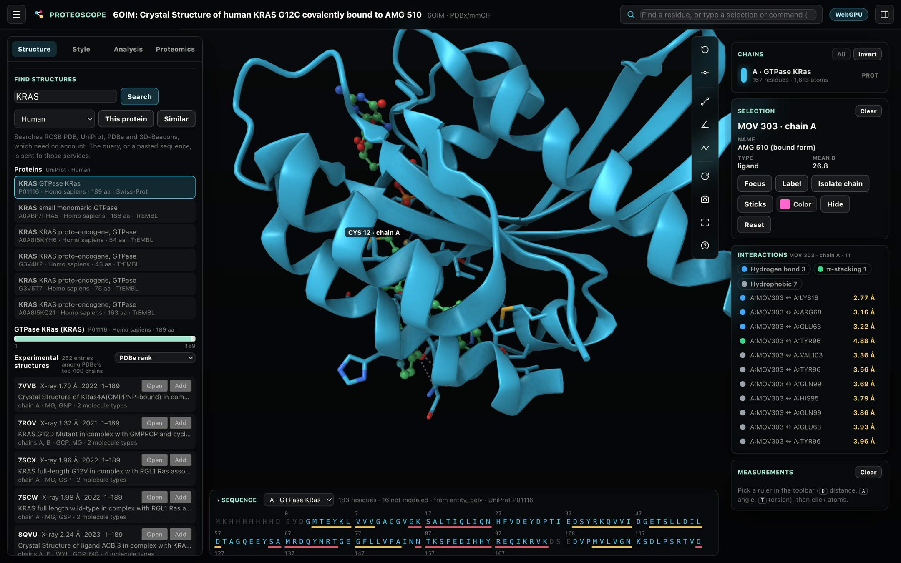

**Find structures** (Structure tab) searches public databases without an
account:

- **A gene or protein name** (`KRAS`, `tumor suppressor p53`) lists the
  matching UniProt entries, exact gene matches first; choose an organism to
  narrow it. Picking one lists its structures and models.
- **A UniProt accession** (`P01116`) goes straight to that protein.
- **A PDB ID** lists that entry; **keywords** (`sotorasib`) search RCSB's
  full text.
- **A sequence** (pasted, FASTA or plain) runs an RCSB sequence search and
  lists the hits with identity, E-value and the aligned range.

For a protein, the list shows:

- **Experimental structures** from PDBe's best-structures list: method,
  resolution, year, covered UniProt range, chains, ligands and title. Sort by
  PDBe's rank, resolution, coverage or release date. A **coverage track** above
  the list shows how many structures cover each part of the sequence, so the
  domains nobody has solved stand out.
- **Models** from 3D-Beacons: AlphaFold DB first, then SWISS-MODEL,
  ModelArchive, PED and the other providers, with their confidence and range.

**Open** replaces the scene; **Add** adds the structure superposed on the
active one. **This protein** lists the structures of the active structure's
protein, and **Similar** searches for sequences like the chain in the sequence
panel. The `search` command does the same from the command line.

A search sends what you type to these services. A pasted sequence, and the
chain's sequence when you use **Similar**, go to RCSB's sequence search, so
use them with care for unpublished sequences.

## Bundled Examples

**Bundled examples** (Structure tab, or `example <id>`) opens curated
structures stored in the binary as gzipped mmCIF (6 MB for all of them), so
they work offline. Each has a short description and an opening view: the
ligand focused, the interface shown, or a comparison set up. `example add <id>`
adds one to the scene without its view; `example` lists them.

| Group | Examples |
| --- | --- |
| Drugs and their targets | 1M17 EGFR–erlotinib, 2HYY ABL–imatinib, 3OG7 BRAF V600E–vemurafenib, 6OIM KRAS G12C–sotorasib, 8GUB PI3Kα H1047R–alpelisib, 6VEI IDH1 R132H–vorasidenib, 7KK4 PARP1–olaparib, 8EF5 μ-opioid receptor–fentanyl with its G protein |
| Targeted protein degradation | 5T35 PROTAC MZ1 bridging BRD4 and VHL, 5FQD lenalidomide gluing CK1α to cereblon |
| Antibodies and immune recognition | 4ZQK PD-1–PD-L1, 5XXY atezolizumab Fab–PD-L1, 1N8Z trastuzumab Fab–HER2, 7OW6 T-cell receptor with a KRAS G12D neoantigen |
| DNA, chromatin and gene editing | 1TUP p53 on DNA, 1YCR MDM2–p53 peptide, 1T29 BRCA1 BRCT–phosphopeptide, 7LYB nucleosome with BRCA1–BARD1, 4OO8 Cas9 with guide RNA and target DNA |
| Conformational change | 4AKE and 1AKE adenylate kinase open and closed (superposed on the CORE domain), 4HHB and 1HHO hemoglobin T and R states, 1JM7 BRCA1–BARD1 NMR ensemble |
| Predicted structures | AF-P04637-F1, the AlphaFold model of p53 with its PAE |
| Viruses and assemblies | 6VXX SARS-CoV-2 spike, 1LP3 AAV2 capsid (60 copies, 249,120 atoms) |

## The Workspace

- **Top bar:** structure title, the search box and command line (press `/`),
  renderer badge, panel toggles.
- **Left panel tabs:**
  - **Structure:** the structures in the scene (when there are several), the
    ranked models of an opened prediction, entry metadata (method,
    resolution, R-free, organism, deposition date), biological assemblies,
    composition and molecules, and the secondary-structure source.
  - **Style:** representations, surface, color scheme, sizes, lighting and
    effects, background, projection and clipping. With several structures,
    changes apply to all of them or only to the active one.
  - **Analysis:** structure comparison, the validation report, interactions,
    solvent accessibility, Ramachandran plot, per-residue profile, PAE with
    domains, contact probabilities and MSA depth.
  - **Proteomics:** search reports, public evidence, sequence properties,
    UniProt annotations, peptides, sites and variants with AlphaMissense,
    cross-links, HDX-MS, custom data.
- **Right panel:**
  - Chains: click to show or hide; double-click to show only that chain.
  - Selection details, interactions of the focused residue, and measurements.
- **Sequence panel:** the full sequence of the chosen chain.
  - Residues missing from the model are grey, and helices and strands are
    underlined.
  - Numbering gaps are marked.
  - After a superposition, a second row shows the aligned residues of the
    other structure, with substitutions highlighted.
  - Click to select, shift-click to add, drag for a range, double-click to
    focus.
- **Toolbar:** reset view, focus, distance, angle and torsion rulers, spin,
  export, full screen, help.
- **Legend:** describes the active color scheme and surface coloring. Click a
  legend title to collapse it.

## Navigation

| Action | Mouse / key |
| --- | --- |
| Rotate (free trackball) | Drag |
| Pan | Shift-drag or right-drag |
| Roll | Alt/Option-drag |
| Zoom | Scroll or pinch |
| Select residue / add to selection | Click / Shift-click (clicking another structure makes it active) |
| Focus a residue or ligand | Double-click, or select and press `F` |
| Reset view | `R` |
| Representation presets | `1` cartoon, `2` ball & stick, `3` sticks, `4` spacefill, `5` trace, `6` surface |
| Search, selections and commands | `/`, then type; ↑ and ↓ recall earlier commands |
| Distance / angle / torsion ruler | `D` / `A` / `T` |
| Label selection | `L` |
| Spin | `S` |
| Orthographic / perspective | `O` |
| Water / hydrogens | `W` / `H` |
| Export image | `P` |
| Clear focus, selection or ruler | `Esc` |
| Shortcuts | `?` |

New structures are framed on their principal axes, with the longest axis
horizontal.

## Representations

The **Representation** presets set the polymer and ligand styles together.
You can also set each component separately:

- **Polymer:** cartoon, trace, ball and stick, sticks, spacefill or hidden.
  - The cartoon draws helices as ribbons, strands as flat arrows and loops as
    tubes, with smooth transitions.
  - Nucleic acids get a phosphate-backbone tube with base slabs.
- **Ligands and ions:** ball and stick, sticks, spacefill or hidden. Ions are
  drawn as spheres; metal-coordination bonds are dashed.
- **Side chains:** *Around focus* (the default) shows side chains within 5 Å
  of the focused residue or ligand. *All* shows every side chain on top of
  the cartoon.
- **Water and hydrogens:** toggles.
- **Surface:**
  - *Molecular (SES)*, *Solvent accessible (SAS)*, *Gaussian* or *van der
    Waals*.
  - Coloring can match the color scheme, Coulombic electrostatics or
    hydrophobicity.
  - Opacity is adjustable; a transparent surface shows the cartoon underneath.
  - Surfaces are computed in a background worker, taking about 0.2 s for a
    5,000-atom protein.

Modified residues such as selenomethionine and phosphoserine stay part of the
polymer. Unknown residues with a linked peptide or sugar-phosphate backbone
are recognized automatically.

## Color Schemes

| Scheme | Notes |
| --- | --- |
| Chain / Molecule (entity) | Palettes: Vivid, Colorblind-safe (Okabe-Ito), Muted (Tol), Pastel |
| Rainbow (N → C) | Sequence position within each chain |
| Secondary structure | Helix, strand, turn, coil |
| Molecule type | Protein, nucleic acid, ligand, ion, water |
| Element | Standard element colors |
| Residue class | Hydrophobic, polar, positive, negative, nucleic acid, ligand |
| Hydrophobicity | Kyte-Doolittle scale |
| Nucleotide | A, C, G, U/T |
| B-factor | Blue-white-red, viridis or magma colormaps |
| AlphaFold confidence (pLDDT) | AlphaFold DB colors: >90 dark blue, 70–90 light blue, 50–70 yellow, <50 orange. Applied automatically to predicted models; ligands of AlphaFold 3, Boltz and Chai-1 models are colored per atom. |
| PAE domains | Rigid domains clustered from the PAE matrix (**Find domains**) |
| MSA depth | Aligned sequences per residue, log scale from red (1) to blue (≥ 1,000) |
| Validation outliers (wwPDB) | Outlier criteria per residue, as in the report's residue plot: green none, yellow 1, orange 2, red 3 or more |
| Fit to density | RSRZ (X-ray; above 2 is an outlier) or Q-score (cryo-EM), from the validation report |
| AlphaMissense pathogenicity | Mean score of the 19 substitutions at each position, blue (benign) to red (pathogenic) |
| Solvent exposure | Relative SASA, after **Compute SASA** |
| Peptide coverage / Custom residue data | From the Proteomics tab |
| Structure | One color per structure; the default when a scene holds several |
| Deviation after superposition | Cα distance to the aligned residue, 0 to 4 Å (blue-white-red) |
| Local agreement (lDDT) | Per-residue lDDT against the compared structure, in the pLDDT colors |
| Ensemble flexibility (RMSF) | Per-residue RMSF across overlaid models |
| Uniform | Any color |

*Heteroatoms by element* (on by default) colors N, O, S and other non-carbon
atoms by element in the structural schemes. Ligand carbons are green.

## Lighting and Effects

| Preset | Look |
| --- | --- |
| Standard | Key light plus headlamp, ambient occlusion, depth fog |
| Soft | Strong ambient occlusion with little direct light, similar to ChimeraX "soft" |
| Illustrative | Flat colors, black outlines and ambient occlusion, for Goodsell-style figures |
| Glossy | Strong specular highlights |
| Neon | Additive glow on a dark background (the original Proteoscope look) |
| Flat | Unlit colors with outlines |

The individual sliders are ambient occlusion strength and radius, outline,
depth fog, glow and specular. Backgrounds are dark, black, gray or white.
**Front clip** and **Back clip** cut slabs through the molecule without
rebuilding geometry; clipped atoms are capped.

## Selection, Focus and Interactions

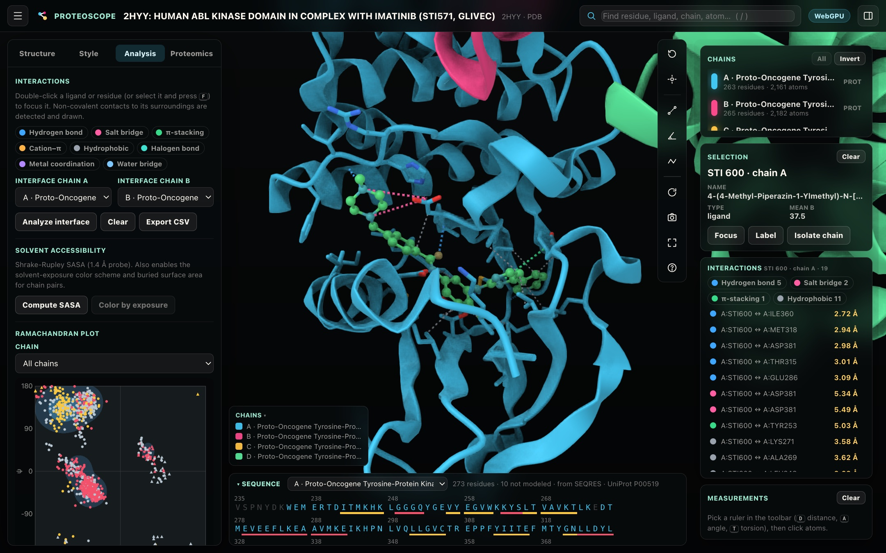

- **Selecting.** Click an atom to select its residue. The selection card
  shows:
  - Residue type, including modifications.
  - Secondary structure and its source, including the DSSP code.
  - φ/ψ angles.
  - B-factor or pLDDT.
  - UniProt position.
  - Relative SASA and proteomics values, when computed.
- **Focusing.** Double-click a residue or ligand (or select one and press
  `F`) to focus it:
  - The camera frames the binding site.
  - Side chains within 5 Å appear.
  - Non-covalent interactions are detected and drawn as colored dashed lines.
- **Interaction types:** hydrogen bond, salt bridge, π-stacking (parallel and
  T-shaped), cation-π, hydrophobic contact, halogen bond, metal coordination
  and water bridge (when water is shown).
  - The criteria follow PLIP (Salentin et al. 2015).
  - Each type can be toggled in the Analysis tab.
  - **Analyze interface** lists the contacts between two chains.
  - **Export CSV** saves the interaction table.
- **Ligand chemistry.** Bond orders, aromatic rings and formal charges come
  from the wwPDB Chemical Component Dictionary:
  - from the file, when its mmCIF carries the dictionary tables (RCSB's files
    do);
  - from a built-in table for standard residues;
  - otherwise from one small dictionary file per ligand, downloaded and
    cached.

  A dictionary entry applies only when the ligand's atom names match it.
  Sticks show double and triple bonds and aromatic rings (**Bond orders** in
  the Style tab: ligands, all residues or off). Interactions use the
  chemistry for donors, acceptors, aromatic rings and charged groups, with
  basic groups protonated by rule: in imatinib only the methylpiperazine
  nitrogen is charged.
- **Labels.** **Label** (or `L`) adds 3D labels to the selected residues.
  **Isolate chain** hides the other chains.

## Docking Poses

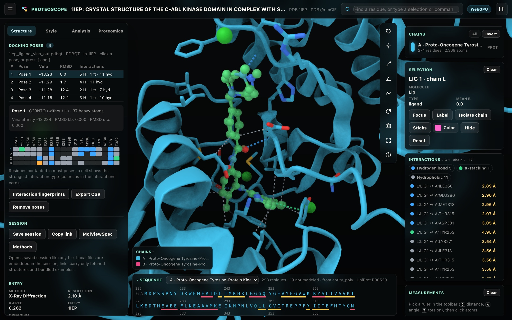

Open an SDF (V2000 or V3000), MOL2 or PDBQT file with the receptor active,
and its molecules become poses in the receptor.

- **Scores** are read from SD properties (Vina, smina and GNINA affinities
  and CNN scores, Glide, GOLD, rDock), DOCK's MOL2 comments, Vina's PDBQT
  remarks and DiffDock's file names (`rank1_confidence-0.52.sdf`). The pose
  table shows the main scores; click a header to sort.
- **Poses.** Click a pose, press `[` and `]`, or run `pose 3`. The shown pose
  is focused with its interactions, and the table gives each pose's
  heavy-atom RMSD to pose 1.
- **Interaction fingerprints** list every pose's interactions with the
  receptor residues around it, as a pose × residue table, to find poses that
  keep the interactions you trust (a hinge hydrogen bond, a salt bridge).
  **Export CSV** saves the scores and fingerprints.
- A pose never bonds to a crystal ligand in the same place, so poses can be
  compared with the deposited ligand. Sessions keep the poses.

## Measurements

Pick a ruler in the toolbar or press `D` (distance), `A` (angle) or `T`
(torsion/dihedral), then click 2, 3 or 4 atoms. Values appear as 3D labels
and in the Measurements card. Remove one with ×, or press Backspace to remove
the last.

## Selections and Commands

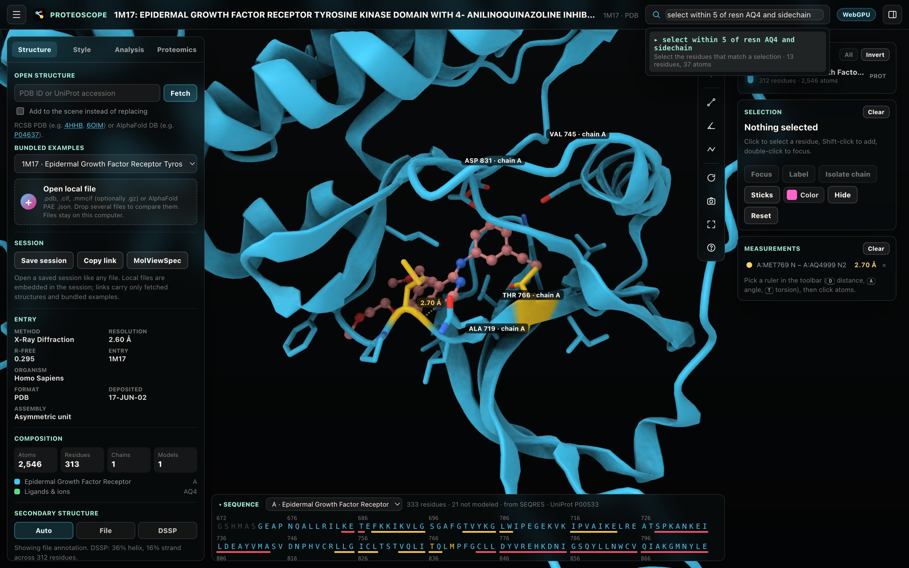

The search box finds residues and atoms, and it is also a command line. Type
a selection and it previews the match live ("22 residues, 108 atoms");
press Enter to select and frame it. Type a command and Enter runs it.
↑ and ↓ recall earlier commands, and Tab completes a command name.

| Type | Result |
| --- | --- |
| `chain A and resi 40-80` | Selects residues 40–80 of chain A |
| `within 5 of resn STI` | Everything within 5 Å of imatinib |
| `show sticks byres (within 4.5 of ligand) and protein` | Side-chain sticks around every ligand, on the cartoon |
| `color magenta /A:315` | Colors residue 315 of chain A |
| `hide water` · `hide chain B` · `show everything` | Hide solvent, hide a chain, show everything again |
| `distance /A:769@N to :AQ4@N2` | The hinge hydrogen bond to erlotinib in 1M17 (2.70 Å) |
| `superpose 1AKE onto 4AKE fit /A:1-29+60-121+160-214` | Fits on the adenylate kinase CORE domain |
| `select deviation > 5` | Residues that moved more than 5 Å after superposing |
| `focus resn HEM and chain A` · `label sele` · `zoom #2` | Focus a ligand, label the selection, frame a structure |
| `tmalign 1A5R onto 1UBQ` | Superposes SUMO-1 on ubiquitin by structure alone |
| `map load` · `map level 1.2` · `map fit` | Loads the density map, contours it at 1.2σ, fits the model |

**Selection language.** PyMOL-style keywords with ChimeraX-style atom specs:

- **Identifiers:** `chain A+B`, `resi 40-80+100A` (author numbering, with
  insertion codes), `resn STI`, `name CA` and `elem FE`, with `*` wildcards.
  `uniprot 175` uses UniProt numbering; `#2` or `structure 1AKE` picks a
  structure.
- **Atom specs:** `/A:40-80@CA,CB` (chain, residues, atoms), `:HEM`, `#2/B`.
- **Classes:** `protein`, `nucleic`, `polymer`, `ligand`, `ion`, `metal`,
  `water`, `hetatm`, `hydrogen`, `backbone`, `sidechain`, `helix`, `sheet`,
  `coil`.
- **Logic:** `and`, `or`, `not` and parentheses; words next to each other mean
  "and".
- **Neighborhoods:** `within 5 of X`, `around 5 of X` (excluding X), and
  `byres X` / `bychain X` to expand to whole residues or chains. Distances
  reach across structures, so `within 5 of (#1 and ligand)` finds residues of a
  superposed structure near another structure's ligand.
- **Values:** `b > 60`, `q < 1`, `plddt < 70`, `deviation > 2`, `lddt < 0.7`,
  `rmsf > 2`, `rsa > 0.4` (after **Compute SASA**), `ppse < 6` (part-sphere
  exposure), `am > 0.564` (AlphaMissense), `msa < 30` (MSA depth), and
  `rsrz > 2`, `rscc < 0.8` and `qscore < 0.4` (validation report),
  `conservation > 0.6` and `grade >= 8` (conservation), and `mapfit < 1` (map
  fit).
- **Sets:** `sele`, `focus`, `sites` (proteomics), `covered` (peptides),
  `aligned` (paired in a comparison), `outliers` (validation report), `idr`
  (disordered regions, after the pPSE analysis).

**Commands.** `select`, `zoom`, `orient`, `focus`, `show`/`hide` (sticks,
ball-stick, spheres, cartoon, surface, water, hydrogens, labels, everything),
`color` (a name, a hex value, a scheme, or `default`), `label`/`unlabel`,
`fetch`/`add`/`remove`/`activate`/`list`/`refresh`, `search`, `example`,
`assembly` (build a biological assembly, or `au`), `interface A B` (contacts
between two chains), `superpose`, `alphafold`, `overlay`, `ranking`,
`domains`, `msa`, `validate` (with `clashes`, `fit`, `refresh` or `off`),
`missense`, `exposure` (pPSE and disorder), `evidence` (public peptides and
PTMs), `tmalign`, `map`, `pose`, `conservation`, `preset`, `lighting`, `bg`,
`distance`, `turn`, `spin`, `reset`,
`save`, `link`, `mvs`, `png` and `help`. The help dialog (`?`) lists the
syntax of each.

Per-residue styling is also on the **Selection** card: **Sticks**, **Color**,
**Hide** and **Reset** apply to the selected residues. **All** in the Chains
card shows hidden residues again.

## Comparing Structures

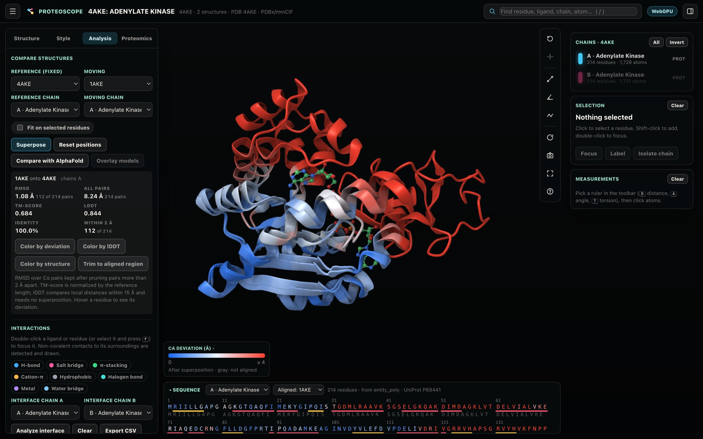

- **Loading several structures.** Tick **Add to the scene instead of
  replacing** before fetching or opening, drop several files at once, pass
  several files on the command line, or use a link such as
  `#fetch=4AKE,1AKE&superpose`.
- **The structures list** (Structure tab) shows every structure with its
  color. Click one, in the list or in the 3D view, to make it active: the
  metadata, chains, sequence, selection and the Analysis and Proteomics tabs
  follow the active structure. The eye button hides a structure and × removes
  it. Scope Style-tab changes to all structures or only the active one.
- **Superpose** (Analysis tab) moves one structure, or all others, onto a
  reference:
  - Residues are paired by a global alignment (BLOSUM62 blended with
    secondary structure, as in ChimeraX *matchmaker*), and principal atoms
    (Cα, or C4′ in nucleic acids) are fitted by least squares.
  - Pairs more than 2 Å apart are pruned iteratively, so a flexible loop or a
    moving domain does not drag the fit. **Fit on selected residues** fits on a
    domain or binding site you selected.
  - Chains are paired automatically by sequence, and identical subunits by
    position; choose chains to compare one pair. When the chains of a complex
    are arranged differently, the fit uses the chain pair that superposes
    best.
  - The result reports RMSD of the fitted core and of all pairs, TM-score
    (normalized by the reference), lDDT, sequence identity and the number of
    pairs within 2 Å, with a per-chain table for complexes.
- **Structure-only pairing.** For remote homologs, whose sequences align
  poorly, set **Pair residues by** to *Structure (TM-align)* or run
  `tmalign`. Residues are paired by structure alone with TM-align (MM-align
  for complexes), ported from US-align and giving its scores. The report adds
  the TM-score normalized by each structure and the aligned length; coloring,
  the aligned sequences and sessions work as for sequence pairing.
- **Seeing differences.**
  - Color by **deviation** (Cα distance after superposition) or **lDDT**, which
    compares local distances and needs no superposition, so a hinge motion
    does not mask a well-preserved domain.
  - Hovering a residue shows its deviation; selecting or hovering highlights
    the aligned residue in the other structure; focusing a binding site shows
    the matching side chains in both.
  - **Trim to aligned region** hides residues outside the compared span.
  - Measurements work between structures.
- **Compare with AlphaFold** fetches the AlphaFold DB model for each UniProt
  accession of the active entry and superposes it by UniProt numbering. The
  experimental structure turns gray, the model keeps its pLDDT colors and is
  trimmed to the aligned span, and its PAE matrix is available when it is
  active.
- **Overlay models** superposes every model of an ensemble (for example an
  NMR structure) on the core the models share and shows them together, with
  mean RMSD and per-residue RMSF; color by RMSF to see the flexible regions.

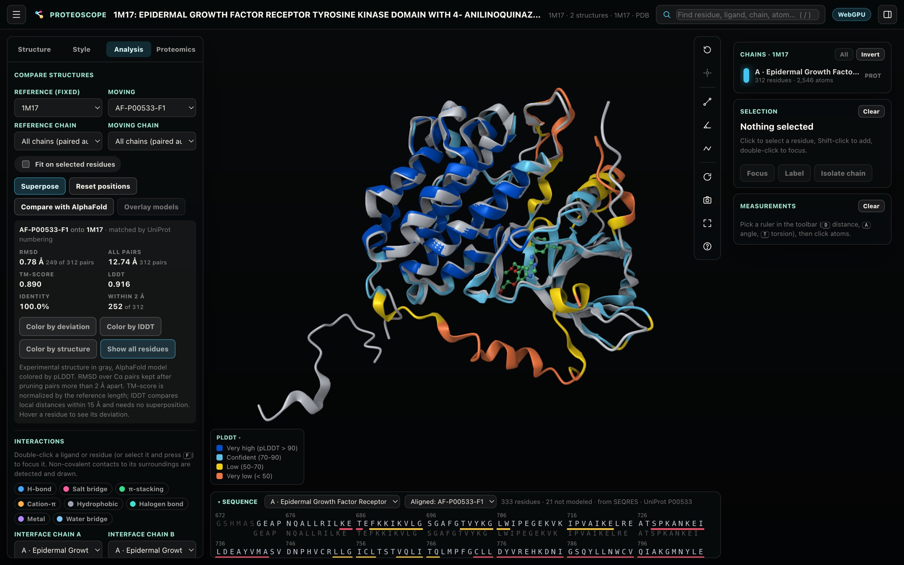

Checked against known cases:

| Comparison | Result |
| --- | --- |
| Adenylate kinase closed (1AKE) onto open (4AKE), chain A | 1.08 Å over 112 core pairs; TM-score 0.68; the LID and NMP domains deviate |
| Human α-globin vs β-globin (4HHB chains A and B) | 44.6% identity with the D-helix gap; 1.10 Å over 120 pairs; TM-score 0.89 |
| EGFR (1M17) vs AlphaFold model P00533 | 0.78 Å over 249 of 312 pairs; TM-score 0.89; lDDT 0.92 |
| Hemoglobin R state (1HHO assembly) onto T state (4HHB) | One αβ dimer fits within 1.1–1.5 Å, the other is rotated (2.7–4.5 Å) |
| SUMO-1 (1A5R) onto ubiquitin (1UBQ), structure-only | 71 pairs at 2.36 Å, TM-score 0.654, as US-align gives; sequence pairing reaches 0.625 |

## Predicted Complexes

Structure predictors write a folder of ranked models with their confidence
data. Proteoscope reads the whole folder, ranks the models, and scores every
interface, so you can decide which predicted interactions to believe without
uploading anything.

**Opening.** Drop the folder, choose it with **Open prediction folder…**, drop
the AlphaFold Server `.zip`, or name the folder on the command line
(`proteoscope af3_output/my_job/`). What is read from each tool:

| Tool | Models | Confidence |
| --- | --- | --- |
| AlphaFold 3 | `seed-*_sample-*/…model.cif` | `summary_confidences.json` (ranking score, pTM, ipTM, chain-pair ipTM), `confidences.json` (PAE, contact probabilities, per-atom pLDDT), MSAs from `…_data.json` |
| AlphaFold Server | `fold_*_model_N.cif` in the downloaded `.zip` | `summary_confidences_N.json`, `full_data_N.json` |
| Boltz-1 / Boltz-2 | `…_model_N.cif` | `confidence_…json`, `pae_…npz` (written with `--write_full_pae`), `plddt_…npz`, Boltz-2 `affinity_…json`, MSAs from `msa/` |
| Chai-1 | `pred.model_idx_N.cif` | `scores.model_idx_N.npz` (aggregate score, pTM, ipTM, chain-pair ipTM, clashes) |
| ColabFold | `…_relaxed_rank_…pdb` (else unrelaxed) | `…_scores_rank_…json` (pLDDT, PAE, pTM, ipTM), `.a3m` |
| Protenix | `seed_*/predictions/…_sample_N.cif` | `…_summary_confidence_sample_N.json` (ranking score, pTM, ipTM, chain-pair ipTM), `…_full_data_sample_N.json` (PAE and contact probabilities, written with `--need_atom_confidence`) |
| OpenFold3 | `…_seed_S_sample_N_model.cif` or `.pdb` | `…_confidences_aggregated.json` (sample ranking score, pTM, ipTM, chain-pair ipTM), `…_confidences.json` or `.npz` (PAE) |

AlphaFold 3 runs saved with `--compress_large_output_files` (`.zst` models
and confidences) open as they are. Samples from several seeds form one ranked
set. Other files in a prediction folder (logs, settings, templates, inputs)
are left alone. Chai-1 does not write PAE to disk, so its models get the
scores Chai reports but not the PAE-based ones.

**Ranking.** The **Prediction** group (Structure tab) lists the models by the
tool's own ranking score. Click a model to show it in place of the current one;
**Superpose all models** opens them all, superposed on the top-ranked model,
to see where they disagree. **Export CSV** saves every model and chain pair
with the scores below; `ranking` lists them from the command line.

**Interface scores.** For each chain pair, computed from the model's PAE,
pLDDT and coordinates with the definitions of Dunbrack's `ipsae.py`:

- **ipTM** as the predictor reports it (for ColabFold, recomputed from the
  PAE). The matrix under the table shows it for every chain pair, with chain
  pTM on the diagonal; switch it to ipSAE or pDockQ2. Click a cell to select
  that interface.
- **ipSAE** (Dunbrack 2025): pTM-style scores averaged only over residue pairs
  whose PAE is below 10 Å (15 Å for AlphaFold 2 / ColabFold), so disordered
  tails and extra domains do not drag the score down the way they do ipTM.
- **pDockQ** (Bryant et al. 2022) and **pDockQ2** (Zhu et al. 2023): interface
  pLDDT, the number of Cβ contacts within 8 Å, and (pDockQ2) the PAE of the
  contacting pairs.
- **LIS** (Kim et al. 2024): the mean of (12 − PAE)/12 over inter-chain pairs
  with PAE below 12 Å.

These scores reproduce `ipsae.py` (version 4) to its printed precision on the
AlphaFold 3 (Aurora A–TPX2) and AlphaFold 2 multimer (RAF1–KSR1–MEK1) examples
of the IPSAE repository and on a Boltz-2 prediction, and a unit test pins them
to `ipsae.py` output at both PAE cutoffs. (The example outputs in that
repository predate version 4 and count PAE = 12 Å in LIS, so their LIS
differs in the fourth decimal.)

**More confidence data.**

- *Contact probability* (AlphaFold 3) sits next to the PAE in the Analysis
  tab.
- *Find domains* clusters the PAE into rigid domains as ChimeraX does.
- *MSA depth* colors each residue by how many sequences were aligned to it;
  shallow alignments are the most common cause of low confidence.
- *Cross-links* mapped in the Proteomics tab add a column with how many links
  each model satisfies.

Sessions keep the model, its PAE, contact probabilities and scores.

## Validation

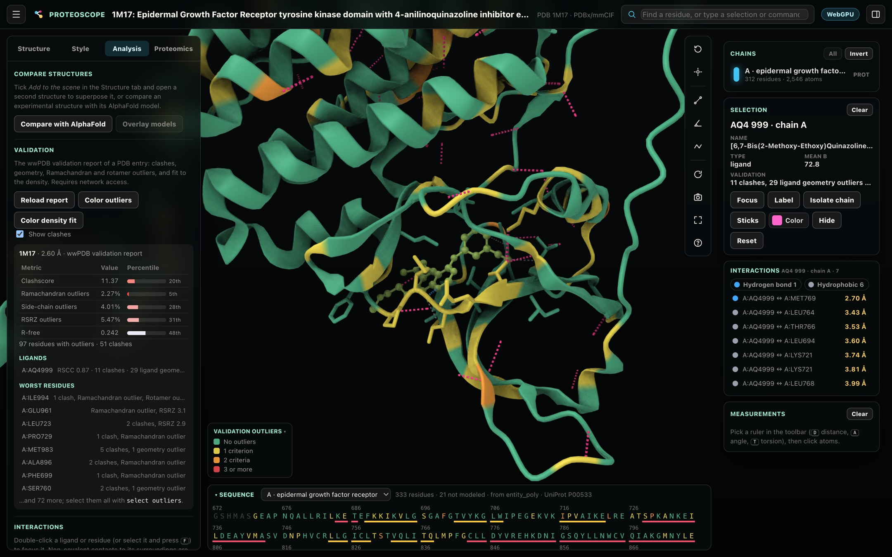

**Load report** (Analysis tab, or `validate`) fetches the wwPDB validation
report of the active PDB entry, the same report RCSB and PDBe publish with
every entry.

- **Summary.** Clashscore, Ramachandran and side-chain outliers, RSRZ
  outliers and R-free (X-ray), or the average Q-score (cryo-EM), each with
  its percentile rank among PDB entries.
- **Per residue.** **Color outliers** colors every residue by how many
  criteria it fails: clashes, bond and angle outliers, Ramachandran and
  rotamer outliers, and RSRZ above 2. **Color density fit** shows RSRZ (X-ray)
  or Q-score (cryo-EM) along the chain. The selection card lists each
  residue's problems with RSRZ, RSCC, Q-score and EDIAm.
- **Ligands.** Each ligand's fit (RSCC, RSRZ) and its Mogul geometry
  outliers, so an unconvincing pose stands out.
- **Clashes.** **Show clashes** draws every reported clash between the atoms
  involved.
- **Selections.** `select outliers`, `rsrz > 2`, `rscc < 0.8` and
  `qscore < 0.4` combine with the rest of the language, for example
  `outliers and within 5 of ligand`.

The **Ramachandran plot** draws MolProbity's Top8000 contours (Williams et
al. 2018) for the six residue categories (general, glycine, trans- and
cis-proline, pre-proline, Ile/Val) and classifies every residue with
MolProbity's criteria. That works for predicted models and local files too;
with a report loaded, the report's classes are shown.

## Density Maps

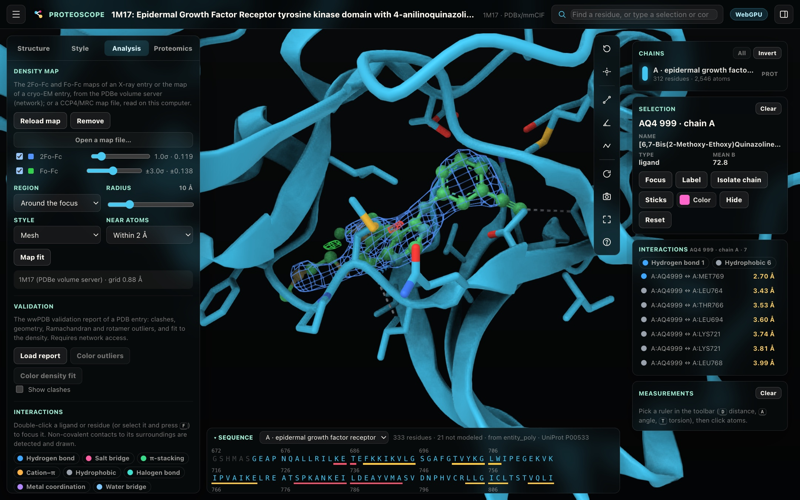

**Load map** (Analysis tab, or `map load`) shows the experimental density of
the active PDB entry:

- **X-ray entries** get the 2Fo-Fc map (blue, 1.5σ) and the Fo-Fc difference
  map (green and red, ±3σ), from the PDBe volume server.
- **Cryo-EM entries** get their EMDB map at EMDB's recommended contour level.
- **Map files.** **Open a map file…** reads a CCP4 or MRC map on your
  computer, for a model you are building or refining.

The map is drawn **around the focus** (or the selection), **following the
view** as you move, or **whole**, as a mesh or a transparent surface. For an
X-ray entry, "whole" is the box around the model, since a crystal's unit cell
need not contain it. Each channel has its own level in σ. **Near atoms** trims
the map to within 1.6–3 Å of the focused atoms, for figures. The server sends
a region at the finest sampling that fits the request, so a small region is
sharper than the whole map. A downsampled view says so and keeps its level in
σ.

**Map fit** samples the full-resolution map at every atom (the server sends
it in tiles):

- Atom inclusion at the contour, as EMDB's validation reports it.
- Per residue, the mean density in σ and the fraction of atoms inside.

Color by **Fit to the loaded map**, plot it in the profile, or select poorly
fitting residues with `mapfit < 1`. For 8GUB in EMD-34272, the atom inclusion
is 0.8935 (EMDB reports 0.896).

## Analysis Tab

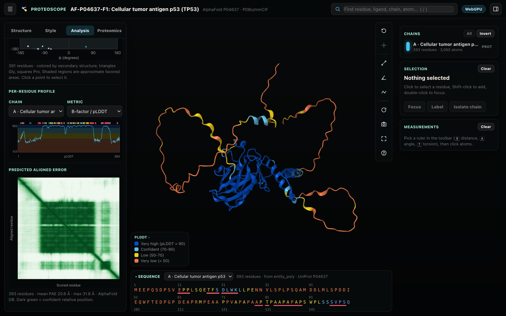

- **Secondary structure.**
  - *Auto* uses the file's HELIX/SHEET or `struct_conf` annotations when
    present, and otherwise computes DSSP (Kabsch & Sander 1983).
  - *DSSP* always recomputes.
  - Chains with only C-alpha atoms fall back to a C-alpha-geometry estimate.
- **Solvent accessibility.**
  - Shrake-Rupley SASA with a 1.4 Å probe gives totals per chain and relative
    exposure per residue (maximum ASA from Tien et al. 2013).
  - It also gives each chain's buried surface area in the complex.
  - After an interface analysis, it adds the buried surface area of that
    interface.
- **Part-sphere exposure (pPSE)** follows StructureMap (Bludau et al. 2022),
  which was built to put PTM sites in structural context. It counts the Cα
  atoms within 12 Å in a 70° cone along each residue's Cα→Cβ direction; with a
  PAE matrix (AlphaFold and other predictions), a neighbor counts only when
  its distance plus the PAE is within the radius, so a confidently placed
  neighbor counts and a floppy one does not. Residues with pPSE ≤ 5 are highly
  exposed. The same count in a 24 Å sphere, smoothed over ±10 residues, marks
  intrinsically disordered regions (`idr`). Color by pPSE, plot it in the
  profile, or select with `ppse < 6`.
- **Ramachandran plot.** φ/ψ per residue on MolProbity Top8000 contours, with
  favored, allowed (yellow) and outlier (red) residues; choose a residue
  category to see its own contours. Glycine and proline are marked. Click a
  point to select the residue.
- **Per-residue profile.** B-factor or pLDDT, relative SASA, pPSE,
  hydrophobicity (9-residue window), AlphaMissense, MSA depth, conservation,
  fit to density or to a loaded map, or custom data along the sequence.
  Click to select.
- **Conservation.** **Compute conservation** scores each residue from a
  multiple sequence alignment:
  - The alignment can be the MSA of an opened prediction, or an alignment
    file whose first sequence is the protein (A3M, aligned FASTA, Stockholm
    or Clustal).
  - The score is the Jensen–Shannon divergence of Capra and Singh (2007),
    with sequence weighting, a gap penalty and a 3-residue window, or Shannon
    entropy.
  - Residues are colored in ConSurf's nine grades, from variable (turquoise)
    to conserved (maroon), and graded by the protein's own score
    distribution.
  - Select with `conservation > 0.6` or `grade >= 8`.

  For p53 on DNA (1TUP), with a UniRef90 alignment of the DNA-binding
  domain, the most conserved residues are the zinc ligands C176, H179, C238
  and C242, followed by S241, R175, and R248 and R273, which contact the DNA.
- **Predicted aligned error.** The PAE heatmap for AlphaFold models and
  predictions. Drag a rectangle to select the residues of both ranges in 3D.
  - **Contact probability** switches the heatmap to AlphaFold 3's contact
    probabilities.
  - **Find domains** clusters the PAE into rigid domains. This follows
    ChimeraX's `alphafold pae colorDomains`: residue pairs under 5 Å PAE are
    weighted by 1/PAE and grouped by greedy modularity. It lists each domain's
    residues and mean pLDDT.
  - **MSA depth** colors by the number of aligned sequences (AlphaFold DB
    models, prediction folders, or a dropped `.a3m`).

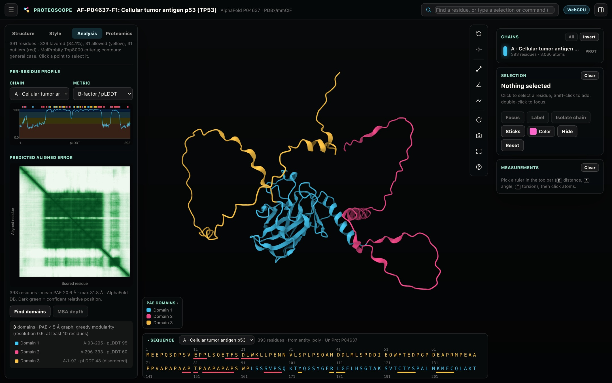

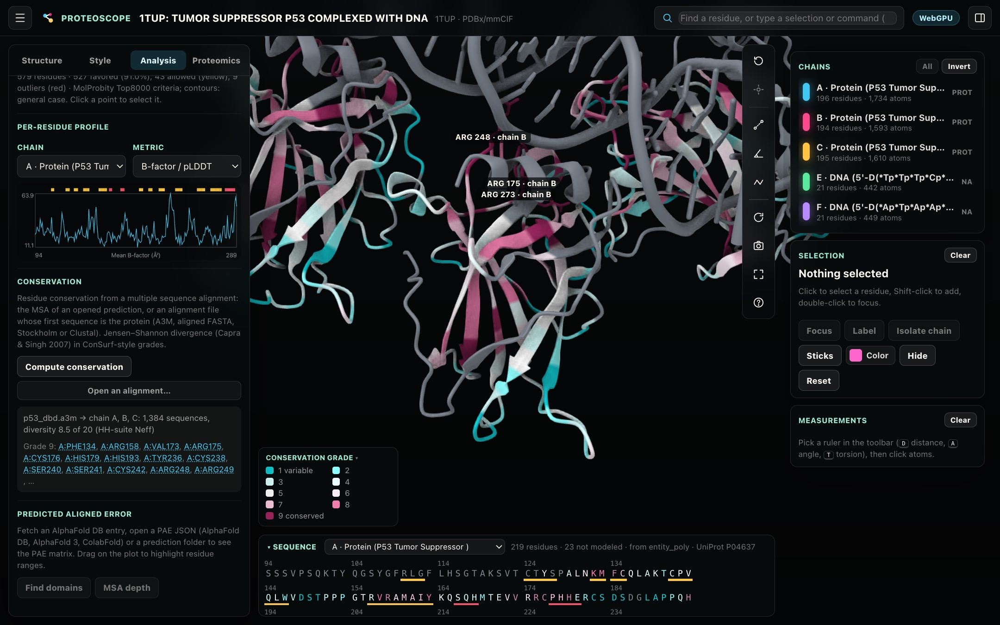

## Proteomics Tab

Everything in this tab runs in the browser. Your data is never uploaded.


- **Search results.** Open a search engine's report (or drop it on the
  window). Proteoscope keeps the rows of the active structure's proteins,
  matched by UniProt accession or by sequence, so a multi-gigabyte report of a
  whole proteome is streamed rather than loaded.

  | Tool | Files |
  | --- | --- |
  | MaxQuant | `evidence.txt`, `peptides.txt`, site tables such as `Phospho (STY)Sites.txt` |
  | DIA-NN | `report.tsv`, `report.parquet` (1.9 and 2.x), `pr_matrix.tsv`, site reports |
  | Spectronaut | Normal and PTM site reports |
  | FragPipe | `psm.tsv`, peptide and site tables |
  | mzTab | Peptide (PEP) and PSM sections, with modification probabilities |
  | Proteome Discoverer | PSM and peptide group exports with ptmRS probabilities |

  - Decoys and contaminants are dropped, and q-value and localization
    thresholds apply as you type. Semicolon-separated exports with decimal
    commas are read as such. Localization probabilities are read from
    each tool's notation (MaxQuant `S(0.98)`, DIA-NN, Spectronaut, ptmRS,
    mzTab).
  - The structure shows coverage, peptide or PSM counts, log10 intensity over
    chosen samples, or the log2 fold change between two groups of samples
    (Spectronaut conditions are grouped automatically).
  - The sites table lists every localized site with its probability, value,
    part-sphere exposure and whether it lies in a disordered region; with
    public evidence loaded, it also says whether the site is already known.
    Click a site to focus it; export the table as CSV.
  - **Differential statistics.** With two sample groups chosen, **Test B vs
    A** runs a moderated t-test on every feature of the whole report, all
    proteins included. The prior of limma's empirical Bayes needs many
    features.
    - Log2 intensities, with median normalization (optional) and a minimum
      number of values per group.
    - Optional imputation of missing values from a down-shifted normal
      distribution, as Perseus does.
    - Benjamini–Hochberg q-values.
    - For PTM sites, the protein's change (the median of its unmodified
      peptides) is subtracted, with Welch–Satterthwaite degrees of freedom,
      as MSstatsPTM does.

    A volcano plot shows the result; click a site's point to focus it. Sites
    are colored by fold change only when significant. The sites CSV gains
    each site's fold change, p, q and degrees of freedom, and for adjusted
    sites the protein's change. The results match limma and MSstatsPTM on
    the same data.

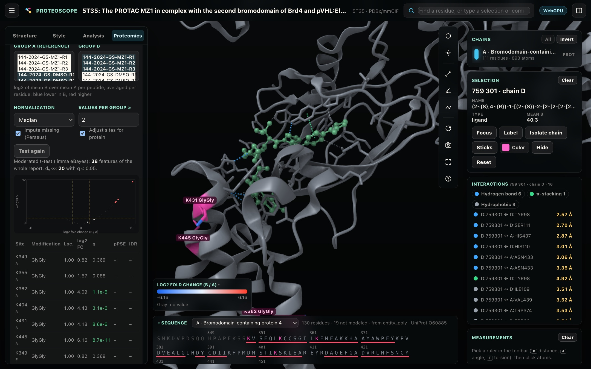

- **Public evidence.** **Load public peptides and PTMs** fetches the peptides
  observed for the structure's proteins in PeptideAtlas, ProteomicsDB and
  other resources, and the modification sites from reprocessed PRIDE datasets
  (PTMeXchange), through the EBI Proteins API. Color the public coverage, mark
  the sites, filter by modification type, and compare with your own report's
  sites (✓ known, **new**).
- **Sequence properties.**
  - Uses ExPASy ProtParam conventions: average and monoisotopic mass, the
    Bjellqvist pI, net charge at pH 7, ε280 with and without cystines,
    absorbance at 0.1 %, GRAVY, the aliphatic and instability indices, and
    aromaticity.
  - Computed from the full deposited sequence when SEQRES or `entity_poly`
    is available.
- **UniProt annotations.**
  - Fetches domains, functional sites, PTMs, disease variants and mutagenesis
    data from UniProtKB.
  - Features are mapped onto the structure through its UniProt
    cross-reference.
  - Filter the list (for example `R175`, `kinase`, `phospho`), click a feature
    to select it, or mark features as sites.

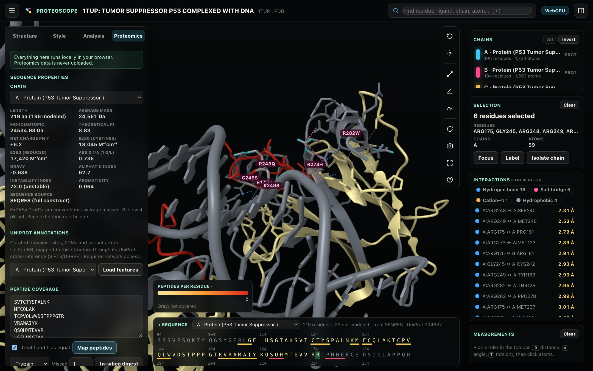

- **Peptide coverage.**
  - Paste peptides, one per line, with an optional value.
  - Understands MaxQuant, Spectronaut, DIA-NN, ProForma 2.0, Comet/SEQUEST and
    FragPipe notation, including modifications.
  - Isoleucine and leucine can be treated as equal.
  - Coverage is mapped onto every matching chain and colored by peptide count.
    Peptide values are averaged per residue.
  - **In-silico digest** generates theoretical peptides for common proteases.
- **Sites and variants.**
  - Accepts `R175H`, `p.Arg248Gln`, `pS15`, `A:K120ac`, `Y1068` and similar.
  - Sites can use structure (author) or UniProt numbering. Wild-type
    mismatches are flagged, which catches numbering offsets.
  - Sites are highlighted, labeled and focused.
  - **AlphaMissense** (Cheng et al. 2023) fetches the pathogenicity of every
    possible substitution from AlphaFold DB (human proteins) and colors the
    structure by the mean score at each position. Substitutions such as
    `R175H` then show their own score. The selection card lists the most
    damaging substitutions at a residue, and `am > 0.564` selects likely
    pathogenic positions. The scores are for research, not clinical use.

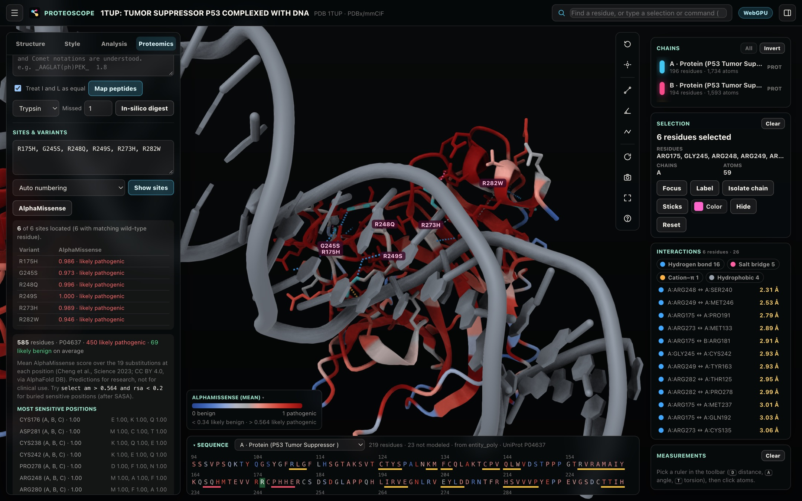
- **Cross-links (XL-MS).**
  - Paste links such as `A:K123-B:K45`, CSV with Protein1, Residue1, Protein2
    and Residue2 columns, or open the export of xiFDR, xiVIEW, pLink 2/3,
    MeroX, XlinkX (Proteome Discoverer), MS Annika or MaxLynx. Decoys are left
    out and repeated identifications merge into residue pairs; proteins are
    matched to chains by chain ID, UniProt accession or name.
  - Cα–Cα distances are checked against the chosen cross-linker's maximum
    (DSS/BS3 30 Å, DSSO 30 Å, PhoX 20 Å, EDC 20 Å, …).
  - **Surface distance (SASD)** measures the shortest path through solvent
    around the protein, as Jwalk does (Bullock et al. 2016),
    which a linker actually has to take; pairs beyond 33 Å are violated.
  - A histogram shows the distance distribution against the cutoff. Links are
    drawn green when satisfied and red when violated. For homo-oligomers the
    shortest chain pairing is used.

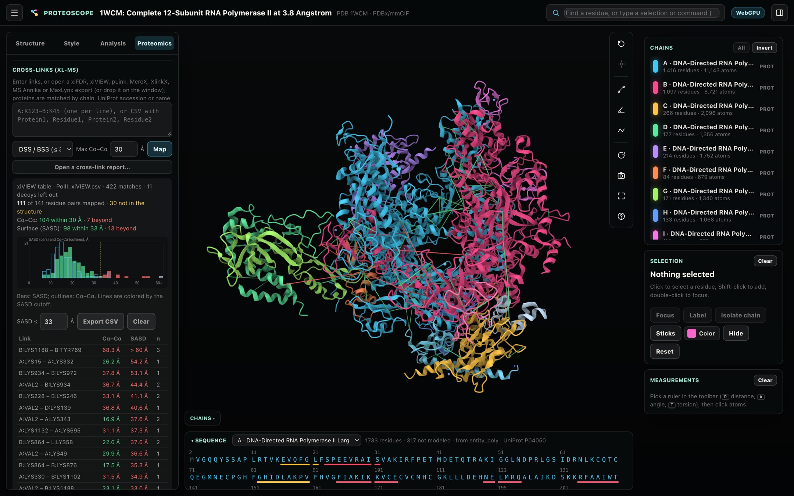

- **HDX-MS.** Open DynamX state or cluster data, HDExaminer results or uptake
  summaries, or an HDX data table in the community format (Masson et al.
  2019).
  - Peptides are matched to the chain sequences; uptake is corrected for the
    undeuterated mass, charge states and replicates are combined, and
    exchangeable amides are counted as DynamX does.
  - **Difference** compares two states: each peptide's ΔD is tested with the
    hybrid significance test (Hageman & Weis 2019) when replicates are known,
    or against a fixed threshold otherwise. The Woods plot shows every peptide
    over its residues, and the structure shows protection (blue) and
    deprotection (red), averaged per residue over overlapping peptides.
  - **Uptake** shows the relative uptake of one state at one or all exposures.

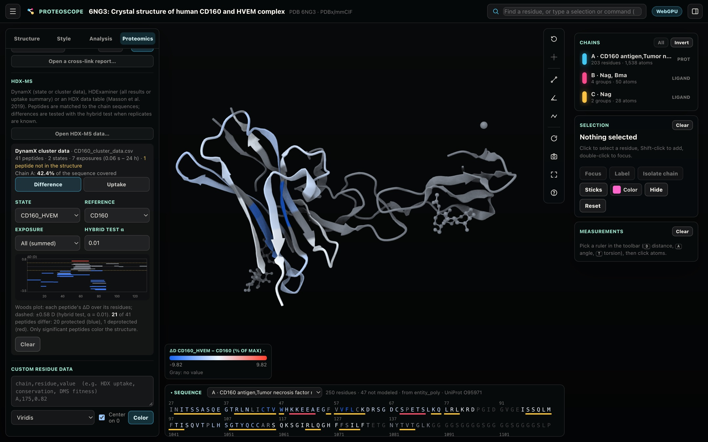

- **Custom residue data.**
  - Paste `chain,residue,value` rows, such as HDX uptake, conservation or DMS
    fitness.
  - Choose a colormap, optionally centered on zero, to color the structure
    and plot the profile.

## Exporting

**Export image** (the camera button, or `P`) renders the current view off
screen:

- Resolution 1× to 4× of the viewport, optionally supersampled for smooth
  edges.
- Optionally a transparent background, the color legend, labels and
  measurements.
- **Copy** puts the image on the clipboard.
- **Spin video** records one full rotation as WebM.

Interaction tables, docking scores and fingerprints, and sites with their
statistics export as CSV.

## Sessions and Sharing

- **Save session** (Structure tab, or the `save` command) writes a
  `.proteoscope.json` file. It records:
  - Where each structure came from: a fetched PDB ID or UniProt accession, a
    bundled example, or the local file itself, embedded and compressed.
  - Styles, per-residue styling and colors, surfaces, superpositions (refitted
    when the session opens), ensemble overlays and trimming.
  - Selections, focus, labels, proteomics overlays and measurements.
  - The camera, lighting, background, clipping and secondary-structure source.

  - PAE matrices and contact probabilities you opened (at 0.125 Å and 1/255
    steps), prediction scores, and MSA depth. Solvent accessibility, PAE
    domains, validation reports and AlphaMissense are recomputed or fetched
    again when the session opens; AlphaFold DB PAE matrices are fetched again.
  - Docking poses (the files, embedded) and the density map's settings. Maps
    from the server are fetched again; map files must be opened again.

  Open a session like any file, or drop it on the window.
- **Copy link** (or `link`) puts the whole session in the URL
  (`#session=…`) when every structure was fetched or is a bundled example.
  The link opens in Proteoscope at the same address and port.
- **MolViewSpec** (or `mvs`) exports the view for
  [Mol*](https://molstar.org/viewer/): an `.mvsj` file that downloads the
  structures from RCSB PDB and AlphaFold DB, or an `.mvsx` archive with the
  files inside when some are local. It carries representations, per-residue
  colors, sticks, surfaces, labels, superposition transforms, the camera and
  the background; Proteoscope's lighting effects are not part of the format.
  Drop the file onto the Mol* viewer to open it.

## Methods and Citation

**Methods** (Structure tab, next to **Save session**) drafts a methods
paragraph from what the session used:

- each structure's source with its ID, experimental method, resolution and
  revision date, or the model's database version;
- each analysis with its method and parameters: superposition, interactions,
  surfaces, density fit, conservation, statistics and others;
- the Proteoscope version.

Citations are numbered, with DOIs checked against Crossref. **Copy
references** or **Download BibTeX** takes them to your manuscript. Check the
text against what you did before using it.

To cite Proteoscope itself, use [CITATION.cff](CITATION.cff) (GitHub offers
it under *Cite this repository*).

## Biological Assemblies and Ensembles

- **Assemblies.** When a file defines biological assemblies (PDBx/mmCIF
  `pdbx_struct_assembly` or PDB `REMARK 350`), choose one under **Biological
  assembly**. Assemblies above 300,000 atoms per model are shown as
  unavailable.
- **Ensembles.** Multi-model files, such as NMR ensembles, show a model slider
  with a play button, and **Overlay models** in the Analysis tab shows all
  models at once.
- Changing the assembly of a structure undoes its superposition, because
  assembly operators are defined in the deposited coordinate frame.

## Structure Parsing Notes

- **Legacy PDB:**
  - Coordinates, `MODEL`/`ENDMDL`, `HELIX`/`SHEET`, `CONECT` and `SSBOND`.
  - Header metadata from `HEADER`, `TITLE`, `COMPND`, `SOURCE`, `EXPDTA`,
    `KEYWDS`, `REMARK 2` and `REMARK 3` (resolution, R-free), and
    `REMARK 350` (assemblies).
  - `SEQRES`, and UniProt mappings from `DBREF`/`DBREF1`/`DBREF2`.
  - Element columns and formal charges. When the element column is missing,
    the element is inferred from the PDB atom-name alignment, so an alpha
    carbon is never mistaken for calcium.
- **PDBx/mmCIF:**
  - `_atom_site`: author and label identifiers, entity IDs, models, formal
    charges.
  - `_entity`, `_entity_poly` and `_entity_poly_seq`.
  - `_struct_conf` and `_struct_sheet_range`.
  - `_struct_conn`: only covalent, disulfide and metal-coordination records
    become bonds.
  - `_pdbx_struct_assembly*` and `_pdbx_struct_oper_list`.
  - `_struct_ref`/`_struct_ref_seq` for UniProt numbering.
  - `_refine`, `_reflns` and `_em_3d_reconstruction` for resolution and
    R-factors, plus the organism and deposition-date categories.
  - ModelCIF `_ma_qa_metric_local` for per-residue pLDDT.
  - `_chem_comp_atom` and `_chem_comp_bond` for ligand bond orders,
    aromaticity and charges.
- **BinaryCIF** (`.bcif`, as served by RCSB's and PDBe's model servers) is
  decoded in the browser and read like PDBx/mmCIF.
- **Predicted models** are recognized from ModelCIF records, the method and
  software names (AlphaFold, ColabFold, ESMFold, Boltz, Chai-1, OpenFold), or
  Protenix's data block name, and every model opened from a prediction folder
  is one. The B-factor column is read as pLDDT, rescaled when a predictor
  writes it on a 0–1 scale; ModelCIF confidences on a 0–1 scale (SWISS-MODEL)
  are rescaled too.
- **Format.** The file name decides between PDB and PDBx/mmCIF, except that
  a file named `.cif` without a data block but with PDB atom records is read
  as PDB.
- **Chain and residue identifiers.** Author chain and residue IDs are used for
  display.
- **Alternate conformers.** The highest-occupancy conformer is kept.
- **Bonds** come from explicit records plus geometry, using element covalent
  radii. The geometric step also finds inter-chain disulfides and metal
  coordination. Bond orders come from the Chemical Component Dictionary, and
  from duplicated `CONECT` records in PDB files.
- **Ligand files.** SDF and molfiles (V2000 and V3000), MOL2 and PDBQT, for
  docking poses.
- **Maps.** CCP4 and MRC 2014 (modes 0, 1, 2, 6 and 12; any axis order;
  either byte order), and the PDBe volume server's BinaryCIF.

## Command-Line Options

```text
proteoscope [flags] [structure files or prediction folders...]

  --host string       interface to bind (default 127.0.0.1)
  --port int          preferred port; nearby ports are tried if busy (default 8765)
  --no-open           do not open a browser
  --offline           disable remote fetching (cached entries still work)
  --cache-dir path    fetch cache location (default: user cache dir/proteoscope)
  --cache-max-age d   refetch cached downloads older than this (default 720h; 0 keeps them)
  --no-cache          do not read or write the fetch cache
  --dev               serve web/ and data/ from disk for development
  --remote-control    accept commands from scripts on this computer (see Scripting)
  --version           print the version and exit
```

With the default `--host`, the server only answers requests whose Host is the
local address, and it always rejects cross-origin API calls. This protects
against DNS-rebinding and cross-site requests. A `--host` such as `0.0.0.0`
serves Proteoscope to other machines on the network; use it only on a network
you trust.

## Scripting

**In the browser console,** `proteoscope.run()` executes any command and
returns `{ ok, message, data }`:

```js
await proteoscope.run('fetch 2HYY');
await proteoscope.run('show sticks byres (within 4.5 of resn STI) and protein');
await proteoscope.run('color salmon resn STI');
const { data } = await proteoscope.run('select within 4 of resn STI');   // residue keys per structure
const png = await proteoscope.snapshot({ scale: 3, transparent: true });  // data URL
const session = await proteoscope.session();                              // the session as JSON
```

**From Python or Jupyter,** start Proteoscope with `--remote-control`, open it
in a browser, and POST commands to `/api/remote/command`. The open page runs
each command and the reply carries its result; `png`, `save`, `link` and `mvs`
return data instead of downloading a file.

```python
import base64
import requests

def ps(command):
    reply = requests.post("http://127.0.0.1:8765/api/remote/command",
                          json={"command": command}, timeout=180).json()
    if not reply.get("ok"):
        raise RuntimeError(reply.get("message") or reply.get("error"))
    return reply

ps("fetch 4AKE")
ps("add 1AKE")
print(ps("superpose 1AKE onto 4AKE fit /A:1-29+60-121+160-214")["message"])
moved = ps("select deviation > 5 and chain A")["data"]    # residue keys that moved > 5 Å
ps("color deviation")
image = ps("png 2")["data"]["image"]                      # PNG as a data URL

from IPython.display import Image
Image(base64.b64decode(image.split(",", 1)[1]))
```

Commands go to the most recently opened Proteoscope page. Remote control is
off unless the flag is given; it accepts requests only from this computer,
whatever `--host` is, and requests from web pages on other sites are refused,
but any program on your computer can send commands while it is on.

## Development

### Requirements

- Go 1.24 or newer.
- Node.js 22 or newer, to run the JavaScript tests.
- A WebGPU-capable browser.

### Run From Source

```sh
go run . --dev
```

`--dev` serves `web/` and `data/` from disk, so edits to the frontend show up
after a browser reload without rebuilding. There is no JavaScript build step.

### Build A Single Binary

```sh
go build -o proteoscope .
```

The executable embeds `web/index.html`, `web/styles.css`, `web/app.js`,
`web/favicon.svg`, `web/lib/*.js` and the examples in `data/`. To bundle your
own examples, put `.pdb`, `.ent`, `.cif` or `.mmcif` files (optionally
gzipped) in `data/` and rebuild. List them in `data/examples.json` to give
them a label, category, description and opening view (a list of commands);
files that are not listed appear after the listed ones.

### Cross Compile

```sh
GOOS=darwin GOARCH=arm64 go build -o dist/proteoscope-darwin-arm64 .
GOOS=darwin GOARCH=amd64 go build -o dist/proteoscope-darwin-amd64 .
GOOS=linux GOARCH=amd64 go build -o dist/proteoscope-linux-amd64 .
GOOS=linux GOARCH=arm64 go build -o dist/proteoscope-linux-arm64 .
GOOS=windows GOARCH=amd64 go build -o dist/proteoscope-windows-amd64.exe .
GOOS=windows GOARCH=arm64 go build -o dist/proteoscope-windows-arm64.exe .
```

### Release

The version is `version` in `main.go`, and `CITATION.cff` repeats it. To
release, set both, add the release to `CHANGELOG.md`, merge to `main` and push
a tag such as `v0.6.0`. The release workflow
(`.github/workflows/release.yml`) checks that the tag matches `main.go`, runs
the tests, builds the six binaries with `-trimpath -ldflags "-s -w"`, and
attaches them with `SHA256SUMS` to a draft release. Review the draft and
publish it. The installers (`install.sh`, `install.ps1`) download the latest
published release by these file names, so keep them when changing the
workflow.

### Test

```sh
go test ./...
node --test "web/lib/*.test.mjs"
node validation/run.mjs
```

The last command compares Proteoscope's analyses with numbers from their
reference tools (limma, MSstatsPTM, US-align, Capra and Singh's scorer, EMDB
and MolProbity); see [validation/README.md](validation/README.md). GitHub
Actions run gofmt, `go vet`, the Go tests with the race detector, the
JavaScript tests, the offline validation suites and the cross-compilation on
every pull request and every push to `main`, and the whole validation suite
weekly.

### Code Layout

| Path | Responsibility |
| --- | --- |
| `main.go`, `fetch.go`, `cache.go`, `local.go`, `security.go` | Local server, embedded assets, fetch proxy and cache, command-line files and folders, request hardening |
| `examples.go` | Bundled examples: the manifest, gzipped files served as they are |
| `search.go`, `evidence.go` | Structure and model search (RCSB, UniProt, PDBe, 3D-Beacons), model downloads, public proteomics evidence |
| `validation.go` | wwPDB validation reports, reduced from XML to per-residue JSON |
| `ligands.go`, `maps.go` | Chemical Component Dictionary entries; density maps from the PDBe volume server (RCSB's copy as a fallback) and EMDB metadata |
| `web/app.js` | Application state, UI wiring, render loop, analysis and proteomics panels |
| `web/lib/parse.js`, `web/lib/bcif.js` | PDB, PDBx/mmCIF and BinaryCIF parsing, assemblies |
| `web/lib/predictions.js`, `web/lib/interface-scores.js` | Prediction folders (AlphaFold 3, Boltz, Chai-1, ColabFold, Protenix, OpenFold3), tokens, ipSAE, pDockQ, pDockQ2, LIS |
| `web/lib/discover.js` | Search query types, grouping and sorting of structures and models |
| `web/lib/reports.js`, `web/lib/parquet.js`, `web/lib/zstd.js`, `web/lib/snappy.js` | Search-report import and summaries; Parquet, Zstandard and Snappy decoding |
| `web/lib/exposure.js`, `web/lib/crosslinks.js`, `web/lib/hdx.js` | Part-sphere exposure and disorder, cross-link report import and surface distances, HDX-MS import and statistics |
| `web/lib/pae-domains.js`, `web/lib/msa.js`, `web/lib/npy.js` | PAE domain clustering, MSA depth, NumPy arrays |
| `web/lib/validation.js`, `web/lib/ramachandran.js`, `web/lib/rama-top8000.js` | Validation-report mapping, MolProbity Top8000 Ramachandran classes and data |
| `web/lib/missense.js` | AlphaMissense tables |
| `web/lib/structure.js` | Residues, polymer typing, bonds, secondary structure, sequences, UniProt mapping |
| `web/lib/dssp.js` | DSSP secondary-structure assignment |
| `web/lib/cartoon.js` | Protein and nucleic-acid cartoon meshes |
| `web/lib/align.js`, `web/lib/superpose.js`, `web/lib/compare.js` | Sequence alignment, least-squares superposition, TM-score, lDDT, RMSF, chain pairing |
| `web/lib/select.js`, `web/lib/commands.js` | Selection language and command-line parsing |
| `web/lib/mvs.js`, `web/lib/zip.js`, `web/lib/codec.js` | MolViewSpec export, ZIP reading and writing, session compression and links |
| `remote.go` | Remote control for scripts (`--remote-control`) |
| `web/lib/scene.js`, `web/lib/coloring.js` | Representation and color-scheme logic |
| `web/lib/renderer.js` | WebGPU renderer: impostors, G-buffer, SSAO, outlines, FXAA, picking, capture |
| `web/lib/renderer-canvas.js` | Canvas 2D fallback renderer |
| `web/lib/camera.js`, `web/lib/math3d.js` | Trackball camera and math |
| `web/lib/surface.js`, `web/lib/surface-worker.js`, `web/lib/electrostatics.js` | Surfaces, SASA, Coulombic potential |
| `web/lib/interactions.js` | Non-covalent interaction detection |
| `web/lib/chemistry.js`, `web/lib/molfile.js` | Ligand chemistry from the CCD (bond orders, aromaticity, charges, hydrogens); SDF, MOL2 and PDBQT docking poses |
| `web/lib/volume.js`, `web/lib/volume-worker.js` | CCP4/MRC and volume-server maps, isosurfaces, map fit |
| `web/lib/tmalign.js` | TM-align and MM-align, ported from US-align |
| `web/lib/stats.js` | Moderated t-test, normalization, imputation, q-values, PTM adjustment |
| `web/lib/conservation.js` | Alignment parsing and conservation scores |
| `web/lib/provenance.js` | Methods paragraph, references and BibTeX |
| `validation/` | Validation against reference tools (their numbers, not the tools) |
| `.github/workflows/` | Continuous integration and the weekly validation run |
| `web/lib/proteomics.js` | Sequence properties, peptide, site and cross-link parsing, digestion |
| `web/lib/sequence-view.js`, `web/lib/plots.js` | Sequence panel, Ramachandran, profile and PAE plots |
| `web/lib/residues.js`, `web/lib/elements.js`, `web/lib/colors.js` | Shared chemistry and color tables |

See [proteoscope-spec/roadmap.md](proteoscope-spec/roadmap.md) for the project
review, a comparison with other viewers and the roadmap.

## Troubleshooting

### The badge says "Canvas preview"

Your browser did not provide WebGPU, so Proteoscope is using a simplified
renderer without surfaces, ambient occlusion or outlines. Open the same address
in Chrome, Edge or Brave. Safari provides WebGPU only from macOS Tahoe (26), so
Safari on macOS Sequoia or earlier always shows the simplified renderer. To
force the compatibility renderer, for example to work around a GPU driver
problem, open `http://127.0.0.1:8765/?renderer=canvas`.

### Fetching fails

Check your network connection, and make sure Proteoscope was not started with
`--offline`. When the network is down, downloads older than the cache's
maximum age are still served from the cache. The error message shows RCSB's or AlphaFold DB's reply, for
example when an entry does not exist. Very large entries can take longer than
the 45-second download limit on slow connections; download the file and open
it locally instead.

### The port is already in use

Proteoscope tries the requested port first and then nearby ports. Use the URL
printed in the terminal.

### My downloaded file does not load

Use a coordinate file ending in `.pdb`, `.ent`, `.cif`, `.mmcif` or `.bcif`,
optionally compressed with gzip or Zstandard. Validation reports and PDFs are
not coordinate files. Docking poses, maps and alignments open into the active
structure, so open the receptor or model first. For a prediction, open the whole output folder (or the
AlphaFold Server `.zip`) so the confidence files come along.

## License

Proteoscope is licensed under the Apache License 2.0. See [LICENSE](LICENSE)
for the full license text.

### Data credits

- The MolProbity Top8000 Ramachandran distributions come from the Richardson
  Lab's [reference_data](https://github.com/rlabduke/reference_data)
  (CC BY 4.0; Williams et al., *Protein Science* 2018).
- AlphaMissense predictions (Cheng et al., *Science* 2023) are fetched from
  AlphaFold DB under CC BY 4.0.
- Validation reports come from the wwPDB.
- The bundled examples are PDB entries (wwPDB, CC0) and the AlphaFold DB model
  of p53 with its PAE (AF-P04637-F1, CC BY 4.0; Jumper et al., *Nature* 2021;
  Varadi et al., *Nucleic Acids Research* 2024). Each example's citation is in
  `data/examples.json`.
- Searches use RCSB PDB, UniProt, PDBe and 3D-Beacons (Varadi et al.,
  *GigaScience* 2022); models downloaded from a 3D-Beacons provider carry
  that provider's terms.
- Ligand chemistry comes from the wwPDB Chemical Component Dictionary
  (Westbrook et al., *Bioinformatics* 2015; CC0). Density maps come from the
  PDB and EMDB archives (CC0) through the PDBe volume server.
- Public proteomics evidence comes from the EBI Proteins API (Nightingale et
  al., *Nucleic Acids Research* 2017), which collects PeptideAtlas,
  ProteomicsDB, PRIDE and PTMeXchange data.
- Methods implemented from their publications: part-sphere exposure and
  disorder from StructureMap (Bludau et al., *PLOS Biology* 2022), surface
  distances after Jwalk (Bullock et al., *Molecular & Cellular Proteomics*
  2016), the HDX-MS hybrid significance test (Hageman & Weis,
  *Analytical Chemistry* 2019), ipSAE (Dunbrack, bioRxiv 2025), TM-align and
  MM-align as in US-align (Zhang & Skolnick, *Nucleic Acids Research* 2005;
  Mukherjee & Zhang, *Nucleic Acids Research* 2009; Zhang et al., *Nature
  Methods* 2022), limma's moderated t-test (Smyth, *Statistical Applications
  in Genetics and Molecular Biology* 2004), MSstatsPTM (Kohler et al.,
  *Molecular & Cellular Proteomics* 2023), conservation scores (Capra &
  Singh, *Bioinformatics* 2007) in ConSurf's colors (Ashkenazy et al.,
  *Nucleic Acids Research* 2016), and Surface Nets (Gibson, MICCAI 1998).
  Full references are in the **Methods** dialog.
