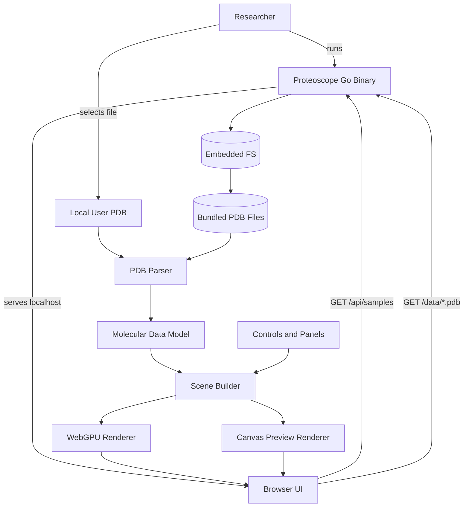
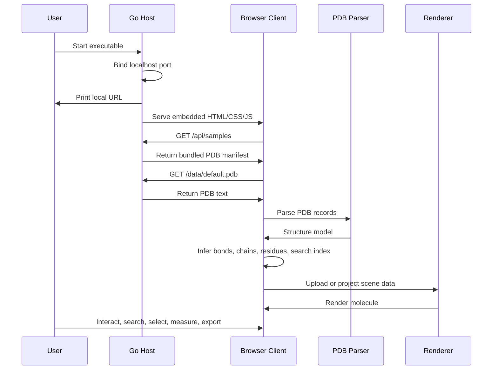
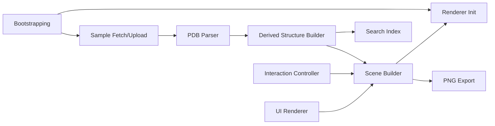

# Design Document: Proteoscope

## Overview

Proteoscope is a local molecular visualization application built as a Go
single-binary web server with an embedded browser frontend. The backend is
minimal by design: it serves static assets, embedded PDB files, a sample
manifest, and health information. The browser frontend owns the scientific
workflow: PDB parsing, bond inference, molecular scene construction, rendering,
search, selection, measurement, and export.

The architecture follows a two-layer local application model:

- **Local Application Host**: Go HTTP server, embedded filesystem, sample
  manifest, and browser launch helper.
- **Browser Visualization Client**: HTML/CSS/JavaScript application with PDB
  parser, molecular data model, interaction state, WebGPU renderer, canvas
  fallback renderer, and UI controls.

Key design principles:

- **Single-file distribution**: All app assets and bundled structures ship in
  one executable.
- **Local-first privacy**: User-selected PDB files are parsed in the browser and
  are not uploaded externally.
- **Scientific competence before spectacle**: Visual polish must preserve
  chemically meaningful atom, residue, chain, ligand, B-factor, and model
  semantics.
- **Progressive rendering capability**: Prefer WebGPU for performance while
  maintaining a fallback path for browsers without WebGPU.
- **Immediate usability**: Bundled structures and an in-browser upload flow let
  users start without setup.

## Architecture

### System Components



### Runtime Flow



## Technology Stack

- **Host Runtime**: Go 1.24+
- **Distribution**: Go `embed.FS` for `web/*` and `data/*.pdb`
- **HTTP Server**: Go standard library `net/http`
- **Frontend**: Plain HTML, CSS, and JavaScript modules
- **Primary Renderer**: WebGPU with WGSL shaders
- **Fallback Renderer**: Canvas 2D compatibility preview
- **Data Format**: Standard `.pdb` coordinate files
- **Build Model**: No Node build step; Go compiler creates final binary

## Host Application Design

### Embedded Content

The Go binary embeds:

- `web/index.html`
- `web/styles.css`
- `web/app.js`
- `web/favicon.svg`
- `data/*.pdb`

This removes runtime dependency on external asset files and supports
cross-platform single-binary releases.

### HTTP Routes

| Route | Purpose |
| --- | --- |
| `/` | Serve the embedded application shell |
| `/app.js`, `/styles.css`, `/favicon.svg` | Serve embedded frontend assets |
| `/api/health` | Return simple health status |
| `/api/samples` | Return metadata for embedded PDB samples |
| `/data/*.pdb` | Serve embedded PDB files |

### Port Selection

The server first attempts the requested host and port. If the preferred port is
unavailable, it tries nearby ports before falling back to an OS-assigned port.
The selected URL is printed to the terminal.

### Browser Launch

Unless disabled with `--no-open`, the host attempts to open the local URL using:

- `open` on macOS
- `rundll32 url.dll,FileProtocolHandler` on Windows
- `xdg-open` on Linux

## Browser Client Design

### Major Client Modules

Although implemented in a single JavaScript module, the client has distinct
logical modules:



### Client State

The browser maintains a single application state object containing:

- Loaded sample manifest
- Active structure
- Active model index
- Representation mode
- Color scheme
- Atom, bond, glow, and clipping controls
- Ligand, water, hydrogen, and motion toggles
- Isolated chain
- Selected atom
- Hovered atom
- Measurement history
- Camera position and orientation
- Visible atom and bond buffers

This design keeps UI controls, rendering, picking, and search synchronized
through a single rebuild path.

## Data Model

### Structure

```text
Structure
  meta
    title
    code
    classification
    method
    resolution
    numModels
  helices[]
  sheets[]
  conect[]
  models[]
  chains[]
  residues[]
  searchItems[]
```

### Model

```text
Model
  number
  atoms[]
  bonds[]
  serialToIndex
  bounds
  bFactorRange
```

### Atom

```text
Atom
  id
  serial
  name
  altLoc
  resName
  chain
  resSeq
  iCode
  x, y, z
  occupancy
  bFactor
  element
  record
  isHet
  isWater
  isHydrogen
  residueKey
  polymerType
  ss
```

### Bond

```text
Bond
  a
  b
  explicit
```

### Search Item

```text
SearchItem
  type
  label
  sublabel
  atomID
  haystack
```

## PDB Parsing Design

The parser is fixed-column oriented and recognizes:

- `HEADER`
- `TITLE`
- `EXPDTA`
- resolution remarks
- `ATOM`
- `HETATM`
- `MODEL`
- `ENDMDL`
- `HELIX`
- `SHEET`
- `CONECT`

Parsing happens entirely in the browser for both bundled and uploaded files.

### Alternate Location Policy

The parser accepts:

- blank alternate location
- `A`
- `1`

Other alternate locations are skipped in the default view. This avoids duplicate
atoms in common crystal structures while preserving a deterministic primary
conformer.

### Multi-Model Policy

PDB files with `MODEL` blocks are treated as ensembles. Proteoscope renders one
model at a time and exposes a model slider. Counts distinguish atoms per active
model from total coordinate records across all models.

## Derived Structure Design

After parsing, the client derives additional data:

- Chain summaries from first model
- Residue summaries from first model
- Secondary-structure assignment from `HELIX` and `SHEET`
- Explicit bonds from `CONECT`
- Inferred covalent bonds from distance and element radii
- Bounds and radius for camera fitting
- B-factor min/max for color scaling
- Search index for residues and atoms

### Bond Inference

Bond inference uses spatial hashing to avoid all-pairs comparisons. Candidate
atoms are evaluated by:

- Distance threshold
- Element covalent radii
- Water and hydrogen exclusions
- Chain boundary rules
- Metal-specific threshold allowance

This produces visually useful polymer connectivity while respecting explicit
PDB connectivity where present.

## Rendering Design

### WebGPU Renderer

The WebGPU renderer uses three pipelines:

- Atom impostor pipeline
- Atom glow pipeline
- Bond billboard pipeline

Atoms are uploaded as storage-buffer records containing position, radius, color,
and alpha. The atom shader renders screen-facing quads and shades them as
spherical impostors. Bonds are rendered as camera-facing strips between atom
positions.

Lighting uses viewer-facing headlamp-style shading, so atoms facing the screen
remain lit as the molecule rotates.

### Canvas Preview Renderer

If WebGPU is unavailable or initialization times out, Proteoscope falls back to a
Canvas 2D renderer. The canvas renderer projects 3D atom and bond positions into
screen space, sorts by depth, draws bonds, draws glow, and then draws atoms with
a centered radial highlight.

The fallback prioritizes usability and compatibility over large-structure
performance.

### Representation Builder

The scene builder filters atoms and creates render records based on:

- Active model
- Representation
- Color scheme
- Chain isolation
- Ligand, water, and hydrogen visibility
- Clipping
- Atom and bond scale
- Measurements

Representation behavior:

- **Ball + Stick**: atoms and inferred/explicit bonds
- **Spacefill**: atoms at van der Waals scale, no standard bonds
- **Backbone**: protein/nucleic backbone trace plus ligands

## Interaction Design

### Camera

The camera is an orbital camera with:

- Target point
- Radius
- Yaw
- Pitch
- Forward, right, and up vectors
- Perspective projection

Pointer events map to:

- Drag: rotate
- Shift-drag: pan
- Wheel: zoom

### Picking

Atom picking uses ray-sphere proximity against currently visible atom records.
The closest visible atom near the pointer ray is selected.

### Measurement

Measurements are sequential:

1. Select first atom
2. Select second atom
3. Compute Euclidean distance in PDB coordinate units
4. Store and render a measurement line

Distances are reported in Angstroms, matching PDB coordinate convention.

### Search

Search is client-side and term-based. A result matches when all query terms are
present in a precomputed lowercase haystack. Residue and atom search items share
one result list.

Known aliases support common ligand names, such as `heme` for `HEM`.

## UI Design

### Panels

- **Structure Summary**: title, renderer mode, bundled sample selector, local
  upload, atom/residue/chain/model counts
- **Search Panel**: residue and atom search
- **Controls Panel**: representation, color scheme, atom scale, bond scale,
  glow, clipping, ligand/water/hydrogen/motion toggles
- **Chain Panel**: chain list and chain isolation
- **Selection Panel**: selected atom details and measurement controls
- **Model Strip**: visible only for multi-model structures
- **Toolbar**: reset view and PNG export

### Visual Style

The interface uses a dark scientific visualization surface with translucent
panels, restrained colors, compact controls, and emphasis on the molecular
scene. The design favors repeated research use over landing-page presentation.

## Error Handling

- Missing PDB coordinates produce a visible load error.
- WebGPU absence or device timeout triggers Canvas preview.
- Port conflicts trigger nearby-port selection.
- Browser auto-open failures are logged but do not stop the server.

## Security and Privacy

- The application binds to localhost by default.
- Uploaded local PDB files are read in the browser.
- No external upload service is used for local structures.
- Release binaries may need OS-specific trust/unblock steps because they are not
  signed by platform vendors.

## Known Limitations

- `.pdb` is supported; `.cif` and `.mmCIF` are not yet supported.
- Biological assembly transformations are not expanded.
- Molecular surfaces are not implemented.
- Electron density maps are not implemented.
- Electrostatics are not implemented.
- Sequence annotation tracks are not implemented.
- Canvas preview is less performant than WebGPU and is not ideal for large
  structures.

