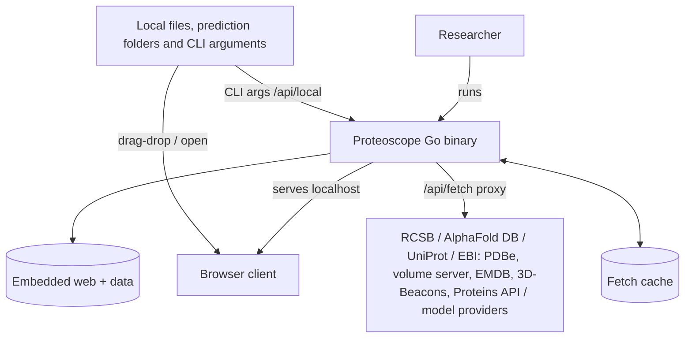
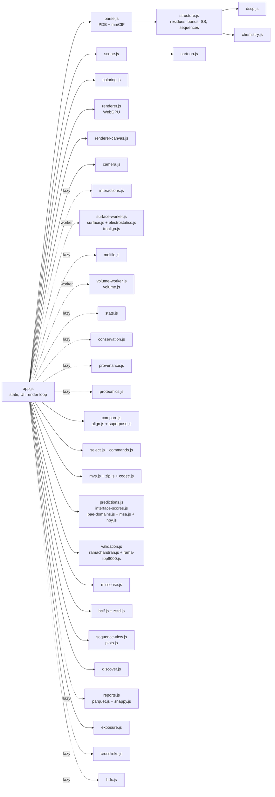
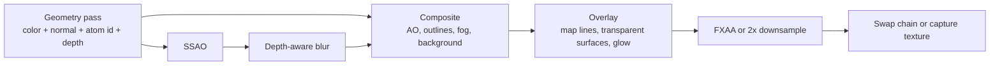

# Design Document: Proteoscope

## Overview

Proteoscope is a local molecular visualization and analysis application built
as a Go single-binary web server with an embedded browser frontend.

The backend serves static assets, the bundled structures, a sample manifest,
files named on the command line, and a small fetch proxy for public databases.
The browser frontend owns the scientific workflow:

- Parsing and structure derivation, including ligand chemistry.
- Secondary structure.
- Representation and color building.
- WebGPU rendering.
- Analysis: interactions, surfaces, SASA, density maps, structure alignment,
  conservation, plots.
- Proteomics overlays and statistics.
- Export, including a methods paragraph with references.

Key design principles:

- **Single-file distribution.** All application assets and bundled structures
  ship in one executable.
- **Local-first privacy.**
  - User files are parsed in the browser and are never uploaded.
  - Remote requests go only to fixed public databases (RCSB, AlphaFold DB,
    UniProt, and EBI services such as PDBe, EMDB and 3D-Beacons), through
    the local proxy.
  - `--offline` disables remote requests.
- **Scientific competence before spectacle.** Chemical and biological
  semantics come first: residue typing, bonds, DSSP, numbering, confidence
  and interactions. Every analysis states its method.
- **Publication-quality rendering.** Ray-cast impostors, ambient occlusion,
  outlines and supersampled export, with a canvas fallback.
- **No build step.** Plain ES modules in `web/lib/` are loaded directly by the
  browser and tested with Node's built-in test runner.

## Architecture

### System Components

```mermaid
graph TB
    User[Researcher]
    Binary[Proteoscope Go binary]
    Browser[Browser client]
    Embed[(Embedded web + data)]
    Cache[(Fetch cache)]
    Remote[RCSB / AlphaFold DB / UniProt / EBI: PDBe, volume server, EMDB, 3D-Beacons, Proteins API / model providers]
    Local[Local files, prediction folders and CLI arguments]

    User -->|runs| Binary
    Binary -->|serves localhost| Browser
    Binary --> Embed
    Binary -->|/api/fetch proxy| Remote
    Binary <--> Cache
    Local -->|drag-drop / open| Browser
    Local -->|CLI args /api/local| Binary
```

### Browser Modules

```mermaid
graph LR
    App[app.js<br/>state, UI, render loop]
    Parse[parse.js<br/>PDB + mmCIF]
    Structure[structure.js<br/>residues, bonds, SS, sequences]
    DSSP[dssp.js]
    Cartoon[cartoon.js]
    Scene[scene.js]
    Color[coloring.js]
    Renderer[renderer.js<br/>WebGPU]
    Canvas[renderer-canvas.js]
    Camera[camera.js]
    Interactions[interactions.js]
    Surface[surface-worker.js<br/>surface.js + electrostatics.js<br/>tmalign.js]
    Chem[chemistry.js]
    Molfile[molfile.js]
    Maps[volume-worker.js<br/>volume.js]
    Stats[stats.js]
    Conserve[conservation.js]
    Cite[provenance.js]
    Proteomics[proteomics.js]
    Compare[compare.js<br/>align.js + superpose.js]
    Select[select.js + commands.js]
    Share[mvs.js + zip.js + codec.js]
    Predict[predictions.js<br/>interface-scores.js<br/>pae-domains.js + msa.js + npy.js]
    Validate[validation.js<br/>ramachandran.js + rama-top8000.js]
    Variants[missense.js]
    Formats[bcif.js + zstd.js]
    Views[sequence-view.js<br/>plots.js]
    Discover[discover.js]
    Reports[reports.js<br/>parquet.js + snappy.js]
    Context[exposure.js]
    XL[crosslinks.js]
    HDX[hdx.js]

    App --> Parse --> Structure --> DSSP
    Structure --> Chem
    App --> Scene --> Cartoon
    App --> Color
    App --> Renderer
    App --> Canvas
    App --> Camera
    App -. lazy .-> Interactions
    App -. worker .-> Surface
    App -. lazy .-> Proteomics
    App --> Compare
    App --> Select
    App --> Share
    App --> Predict
    App --> Validate
    App --> Variants
    App --> Formats
    App --> Views
    App --> Discover
    App --> Context
    App -. lazy .-> Reports
    App -. lazy .-> XL
    App -. lazy .-> HDX
    App -. lazy .-> Molfile
    App -. worker .-> Maps
    App -. lazy .-> Stats
    App -. lazy .-> Conserve
    App -. lazy .-> Cite
```

Modules in `web/lib/` are pure (no DOM access) except `renderer*.js`,
`sequence-view.js` and `plots.js`. Pure modules run in the browser, in Web
Workers and in Node tests. Interactions, proteomics, electrostatics, the
Top8000 Ramachandran tables, the report, cross-link, HDX and docking-pose
readers, statistics, conservation and the methods text load lazily on first
use. Maps are parsed, contoured and fitted in their own worker; TM-align runs
in the surface worker.

## Host Application Design

### Embedded Content

`//go:embed` includes `web/index.html`, `web/styles.css`, `web/app.js`,
`web/favicon.svg`, `web/lib/*.js` and `data/`: the examples as gzipped mmCIF
plus `data/examples.json`, which gives each a label, category, description,
credit and opening view. Test files (`*.test.mjs`) and test data are not
embedded. `--dev` serves `web/` and `data/` from disk instead.

### HTTP Routes

| Route | Purpose |
| --- | --- |
| `/` and static assets | Embedded application |
| `/api/health`, `/api/samples` | Health check and the examples manifest, in manifest order (listed examples are described by the manifest, not parsed, so startup stays fast) |
| `/api/startup` | Version, offline flag and files given on the command line (with folder-relative paths) |
| `/api/local/{index}` | A file named on the command line, or found in a folder named there (gzip decoded) |
| `/api/fetch/pdb/{id}` | RCSB PDBx/mmCIF by PDB ID, including extended `pdb_` IDs |
| `/api/fetch/afdb/{accession}` | AlphaFold DB model; the file URL comes from the prediction API |
| `/api/fetch/afdb/{accession}/pae` | AlphaFold DB PAE JSON |
| `/api/fetch/afdb/{accession}/msa` | AlphaFold DB alignment (A3M) for the model; AlphaFold DB currently refuses these (HTTP 403), which the route reports |
| `/api/fetch/afdb/{accession}/missense` | AlphaMissense substitutions (CSV), human proteins |
| `/api/fetch/uniprot/{accession}` | UniProtKB entry with feature annotations |
| `/api/fetch/validation/{id}` | wwPDB validation report, reduced from XML to per-residue JSON |
| `/api/fetch/model?url=` | A model file listed by 3D-Beacons, from an allowed provider host |
| `/api/fetch/proteomics/{accession}` | Public peptides and PTM sites (EBI Proteins API), merged |
| `/api/fetch/ccd/{id}` | A Chemical Component Dictionary entry (RCSB), for ligand bond orders, aromaticity and charges |
| `/api/fetch/volume/{source}/{id}` | Volume-server header for an X-ray entry (`x-ray`, PDB ID) or a cryo-EM map (`em`, EMDB ID): sampling levels, statistics and cell. PDBe first, RCSB's copy second |
| `/api/fetch/volume/{source}/{id}/box?min=&max=&detail=` | The map inside a Cartesian box, as BinaryCIF (at most 1,000 Å a side) |
| `/api/fetch/volume/{source}/{id}/cell?detail=` | The whole map, as BinaryCIF |
| `/api/fetch/emdb/{id}` | EMDB map metadata, for the recommended contour level |
| `/api/search/text`, `/api/search/sequence` | RCSB full-text and sequence search, with entry summaries from RCSB GraphQL |
| `/api/search/uniprot` | UniProt protein search (exact gene matches first; optional organism) |
| `/api/search/protein/{accession}` | PDBe best structures and 3D-Beacons models of a protein |
| `/data/*` | Bundled examples: `name.cif` is served from `name.cif.gz`, passed through with `Content-Encoding: gzip` when the browser accepts it |

Fetch responses carry `X-Proteoscope-Filename`, `-Source`, `-Cache` and, for
AlphaFold DB, `-Pae`, `-Msa`, `-Missense` and `-Meta-B64` headers. Payloads are
cached on disk with atomic writes and refetched after `--cache-max-age`
(30 days; search answers after a day). If the refetch fails, the stale copy
is served (`-Cache: stale`), and `?refresh=1` bypasses the cache. An answer
assembled while one of several services failed (evidence, a protein's
structures and models) is served with its problems but not cached
(`-Cache: partial`), so the next request asks again.

### Security

- **Host check.** Requests must name a loopback host, or the `--host` value,
  in the `Host` header. This blocks DNS rebinding.
- **Cross-origin checks.** API requests with a foreign `Origin` or a
  cross-site `Sec-Fetch-Site` are rejected.
- **Headers.** HTML is served with a strict CSP (`script-src 'self'`,
  `connect-src 'self'`). All responses carry `nosniff`, `no-referrer`, COOP
  and CORP.
- **Upstreams.** Only fixed hosts, with size and time limits. Redirects are
  followed only within the same host.

## Data Model

The application state holds a list of **entries**, one per loaded structure,
and the active entry. An entry holds the structure plus everything that
belongs to it: display and color settings, surface, selection, focus, labels,
interactions, SASA, proteomics overlays, PAE, visibility, its cumulative rigid
transform, and the last superposition in which it moved (pairs, per-residue
deviation and lDDT, statistics). Wave 6 adds a density map (source, channels
and their levels, region and fit), docking poses, conservation scores and a
search report's statistics. The per-structure fields on the state object
(`state.structure`, `state.display`, `state.selection`, …) are accessors for
the active entry, so single-structure code paths are unchanged.

A **structure** holds:

- Metadata: title, code, method, resolution, R-free, organism, deposition
  date, and whether the structure is a predicted model.
- Entities, chain→entity mapping and declared sequences (SEQRES or
  `entity_poly_seq`).
- UniProt segments, per-residue confidence (ModelCIF), component names, and
  secondary-structure ranges.
- Chemical components (`components`: CCD atoms with charges and hydrogen
  counts, bonds with orders and aromatic flags) read from the file or fetched,
  and bond orders from duplicated CONECT records.
- Explicit connections, assemblies, models, chains and sequences.

A **model** holds atoms, residues, `residueMap`, `atomResidue` (atom →
residue index), bonds (`{a, b, kind, order, aromatic}`, where kind is
`covalent` or `metal`), bounds, the B-factor range and a cartoon cache. Its
`chemistryVersion` changes whenever chemistry is applied again (a fetched
component arrived, poses were added), which invalidates cached bond
decorations and interaction typing.

An **atom** carries:

- Identity: `id` (its index in the model), serial, name.
- Residue identity: `resName`, `chain`/`authChain`/`labelChain`,
  `resSeq`/`authSeq`/`labelSeq`, `iCode`, `entityId`.
- Coordinates and scalars: coordinates, occupancy, B-factor, formal charge,
  element.
- Classification: `kind` (protein, nucleic, ligand, ion or water) and
  secondary structure.
- Chemistry: `aromatic`, and `hydrogens`, the number of attached hydrogens
  (explicit in the dictionary, or implicit from valence).

A **residue** carries:

- Its atoms and an `atomByName` map.
- Backbone atoms (protein) or nucleic backbone atoms.
- Identity and type: `kind`, `parent` (e.g. MET for MSE), a one-letter code
  and a `modified` flag.
- Chain linkage: `linkedToPrevious`, computed from peptide or phosphodiester
  geometry.
- Secondary structure: `ss`, `ssSource`, `dssp`.
- Geometry and quality: φ/ψ, mean B-factor, occupancy, confidence.

## Parsing Design

- **PDB (fixed columns).**
  - Coordinates, models, HELIX/SHEET, CONECT and SSBOND.
  - Metadata: HEADER, TITLE, COMPND, SOURCE, KEYWDS, EXPDTA, REMARK 2 and 3
    (resolution, R-free), HETNAM, SEQRES, DBREF/DBREF1/DBREF2.
  - Assemblies from REMARK 350.
  - Element inference follows the atom-name alignment convention when the
    element column is missing.
- **PDBx/mmCIF.**
  - The tokenizer follows CIF quoting rules: a quote ends a value only when
    followed by whitespace.
  - Loops are stored column-wise, so `_atom_site` is read without creating an
    object per row.
  - Only covalent, disulfide and metal-coordination `_struct_conn` records
    become bonds; hydrogen-bond records do not.
  - ModelCIF `_ma_qa_metric_local` supplies per-residue pLDDT.
  - `_chem_comp_atom` and `_chem_comp_bond`, when present, supply the
    ligands' chemistry; `pdbx_formal_charge` supplies charges.
- **Ligand files** (`molfile.js`): SDF V2000 and V3000 (charges from the atom
  block, `M  CHG` or `CHG=`), MOL2 (SYBYL types, aromatic and amide bonds) and
  PDBQT (AutoDock types; bonds inferred by distance), with scores from
  properties, comments and remarks.
- **Maps** (`volume.js`): CCP4/MRC 2014 (axis order, start indices, origin,
  modes 0, 1, 2, 6 and 12, either byte order) and the volume server's
  BinaryCIF (one data block per channel, 8-bit interval quantization), both to
  an affine grid: origin plus integer steps along three axis vectors.
- **Alternate locations.** The highest-occupancy conformer is kept
  (deterministic ties). Aliases keep CONECT serial numbers resolvable.

## Structure Derivation

- **Residue kinds.** Kinds come from name tables. Unknown residues with a
  linked peptide or sugar-phosphate backbone are promoted into the polymer.
- **Bonds.**
  - Explicit records are applied first.
  - Then a spatial hash with 2.9 Å cells finds bonds using element covalent
    radii.
  - Cross-chain bonds are allowed only for ligands and disulfides.
  - Metal–ligand pairs up to 2.8 Å become `metal` bonds.
- **Secondary structure.**
  - DSSP is always computed.
  - The *Auto* mode uses file annotations when present, otherwise DSSP.
  - C-alpha-only chains use a geometric estimate.
- **Sequences.**
  - Declared sequences are aligned to modeled residues: by `label_seq_id` for
    mmCIF, and by Needleman–Wunsch for PDB SEQRES.
  - UniProt segments map between author and UniProt numbering.
- **Chemistry** (`chemistry.js`). Each residue's component comes from the
  file, from the built-in standard-residue table or from a fetched CCD entry.
  A component applies only when every heavy atom matches it by name and
  element. Then intra-residue bonds follow the dictionary (bonds it lacks are
  dropped, missing ones added when the atoms are within 3 Å) with their
  orders and aromatic flags. Components marked isolated (docking poses) are
  never bonded to other residues. Atoms get aromatic flags and implicit
  hydrogen counts from valence and charge. The page fetches missing
  components after the first draw and applies chemistry again.

## Rendering Design

### WebGPU Frame

```mermaid
graph LR
    G[Geometry pass<br/>color + normal + atom id + depth] --> AO[SSAO] --> B[Depth-aware blur]
    G --> C[Composite<br/>AO, outlines, fog, background]
    B --> C
    C --> O[Overlay<br/>map lines, transparent surfaces, glow]
    O --> F[FXAA or 2x downsample]
    F --> S[Swap chain or capture texture]
```

- **Spheres.** Camera-facing quads sized to the perspective silhouette. The
  fragment shader ray-casts the sphere, writes `frag_depth`, and caps spheres
  cut by the front clip plane.
- **Cylinders.** Oriented bounding-box proxies, ray-cast in the fragment
  shader. They use split colors and pick the atom at the nearer end. Optional
  dashes and round caps support measurement, interaction and cross-link
  lines.
- **Meshes.** Cartoon and surfaces are indexed triangle lists with smooth
  normals. The per-vertex atom index looks up the atom's color and
  selection flags, so recoloring and selection never rebuild geometry. Map
  surfaces carry their own vertex colors and are not pickable.
- **Multiple bonds.** Sticks draw double bonds as two thinner cylinders,
  triple bonds as three, and ring bonds as the full bond plus a shortened
  inner cylinder toward the ring center (dashed when aromatic); the offsets
  come from the ring or the substituent plane.
- **Lines.** Map meshes are screen-space wide lines: each segment becomes a
  quad in the vertex shader, with anti-aliased coverage, fog, and depth
  tested against the scene without writing depth. They are drawn first in the
  overlay pass, and their width scales with supersampled captures.
- **Per-atom buffers.** Color and flags (selected, hovered, dimmed) are
  storage buffers indexed by atom ID. Several structures share them: every
  rendered model (the active model of each entry, or all models of an
  overlaid ensemble) gets a contiguous slice. Sphere and cylinder instances
  carry global indices; cartoon and surface meshes keep local indices and a
  per-mesh atom-offset uniform, so moving a slice never re-uploads a mesh.
- **Depth.** Reversed-Z on `depth32float`.
- **Clipping.** Front and back view-depth planes are applied in the shaders.
- **Transparency.** Transparent surfaces use a depth pre-pass followed by a
  single-layer blend.
- **Picking.** The atom-ID target is copied into a 9×9 readback window, and
  the hit nearest the cursor is used.
- **Capture.** Off-screen targets are rendered at 2× and downsampled with
  premultiplied alpha, then un-premultiplied on the CPU. Transparent
  backgrounds are supported.
- **On-demand rendering.** A frame is drawn only when the scene, camera,
  colors or flags change, or while an animation runs.

### Canvas Fallback

The Canvas 2D fallback consumes the same instance buffers and cartoon polyline
shapes. It sorts them by depth and applies depth cueing. It draws no surfaces,
ambient occlusion or outlines.

### Representations

- **Scene building.** Each atom gets a style from its component: polymer
  (cartoon, trace, ball-and-stick, sticks, spacefill or hidden), ligand, ion
  or water. Side chains are drawn around the focus or everywhere.
- **Cartoon coverage.** Residues outside the cartoon, such as isolated
  residues, fall back to ball-and-stick so nothing disappears.
- **Cartoon geometry.**
  - Catmull–Rom splines through C-alpha atoms. Sheet control points are
    smoothed.
  - Ribbon orientation comes from carbonyl guide vectors.
  - The cross-section is a superellipse whose width, thickness and exponent
    morph per sample: ellipse helices, flat sheets and round coils.
  - Arrowheads use a step face.
  - Nucleic acids get a phosphate-trace tube, base-ring slabs and
    glycosidic connectors.

## Comparison Design

- **Residue pairing** (`align.js`, `compare.js`).
  - Gotoh global alignment with affine gaps and free end gaps. Protein scores
    blend BLOSUM62 with a secondary-structure matrix (30% weight; helix and
    strand gap opening 18, otherwise 6; extension 1), as in ChimeraX
    matchmaker. Nucleic acids use identity scoring with T equal to U.
  - Chains are paired by alignment score. Several near-top chain pairs seed
    candidate pairings; each extends to the other chains by nearest centroid
    after the seed fit, and the pairing whose fit keeps the most residues
    wins, with matching chain IDs as the tie-breaker.
  - Alternatives: UniProt numbering (SIFTS/DBREF segments against AlphaFold DB
    numbering) and shared residue keys (models of one ensemble).
- **Fitting** (`superpose.js`).
  - Horn's closed-form quaternion solution on Cα (protein) or C4′ (nucleic
    acid) atoms; the quaternion form cannot produce a reflection.
  - Iterative pruning as in ChimeraX: each cycle removes the lesser of 10% of
    the remaining pairs and half of those beyond 2 Å, until none are beyond.
  - Candidate fits on all chains and on each chain pair are scored by how
    many pairs they bring within 2 Å.
- **Scores.** RMSD (core and all pairs); TM-score maximized with the TM-score
  program's search (fragment seeds of decreasing length, refit on pairs
  closer than d0_search), normalized by the reference length; lDDT over
  paired principal atoms (15 Å inclusion radius, thresholds 0.5, 1, 2 and
  4 Å); per-chain RMSD and TM-score; RMSF about the mean for ensembles.
- **Moving structures.** Superposition rewrites the moving entry's atom
  coordinates and composes its cumulative transform, so every downstream
  feature (cartoon, surfaces, labels, measurements, picking) needs no special
  case. **Reset positions** applies the inverse. Assembly operators are defined
  in the deposited frame, so changing an assembly first undoes the transform.
- **Correspondence.** Residue-key maps between entries (direct, or through a
  shared reference) drive mirrored selection, hover and focus, deviation and
  lDDT coloring of both structures, and the aligned sequence row.

- **Structure-only pairing** (`tmalign.js`). A port of US-align's TM-align
  (Cα, or C3′ for nucleic acids) and MM-align for complexes, run in the
  surface worker. Its residue pairs and transform replace the sequence
  alignment and pruning; RMSD, aligned length and both TM-scores come from
  its result, and lDDT and deviations are computed on its pairs as usual.

## Density Maps

- **Loading.** An X-ray entry gets its 2Fo-Fc and Fo-Fc channels and a
  cryo-EM entry its EMDB map (ID from the file's related-entry records). The
  page reads the volume server's header and picks the finest detail level
  whose voxel count fits the budget: 2²¹ voxels for a box around the focus,
  2²³ for a whole map. Map data come from the server that sent the header
  (`server=`), whose statistics set the levels. Local CCP4/MRC files are held
  whole by the worker.
- **Downsampled data.** The server downsamples a large region, which narrows
  its values; the contour level then keeps its σ, using the header's
  statistics at that sampling rate, and the status says so.
- **Regions.** *Around the focus* and *Follow the view* request a box on a
  2 Å grid around the focus (or the selection) or the view center, in the
  deposited frame (the inverse of the entry's transform), and ask again once
  the camera, focus or selection settles. *Whole map* contours once; for an
  X-ray entry it is the box around the model, which the server fills by
  symmetry. Geometry is committed only when an update is still current, so a
  superseded update leaves nothing behind.
- **Contouring** (`volume-worker.js`). Surface Nets on the region: one
  vertex per cell that the level crosses, placed at the mean of its edge
  crossings; quads join the cells around each crossed edge. It gives smooth
  surfaces with fewer triangles than marching cubes, and the quad edges draw
  as the mesh. A negative level (Fo-Fc) contours the region below
  it. *Near atoms* keeps vertices within the zone of the focused or selected
  atoms.
- **Fit.** `mapFit` samples the map trilinearly at each heavy atom: atom
  inclusion at the contour level (atoms outside the map count as outside, as
  in EMDB's count), and per residue the mean value in σ and the fraction of
  atoms inside. Server maps are fitted at full resolution, in tiles of at
  most the server's largest request, whose results are added up.
- **Sessions** keep the source, channel levels and style; maps from the
  server are fetched again, files must be opened again.

## Ligands and Docking Poses

- **Poses.** A docking file becomes a set of molecules. The shown pose is a
  residue `LIG` (`LG1`… when the receptor uses that name, so their dictionary
  entries never mix) in chain L or another letter the receptor does not use.
  It is spliced into the receptor's model at the file's coordinates moved by
  the entry's transform, and marked isolated so no bond joins it to a crystal
  ligand in the same place. Switching poses replaces its atoms and rebuilds
  the model's derived data. PDBQT poses, which have no bond orders, are
  typed from geometry.
- **Fingerprints.** Each pose's interactions are computed on a small model
  of the receptor residues within 9 Å of any pose, so hundreds of poses cost
  little more than one. Waters are left out, and so is a ligand the poses sit
  on (most of its atoms within 1.5 Å of a pose); cofactors such as heme stay
  as partners.
- **Typing.** Interactions use the chemistry when it is known: donors need
  a hydrogen (explicit, or implicit from valence), acceptors a lone pair;
  aromatic rings are those the dictionary marks or that are planar with sp2
  atoms; charged groups follow protonation rules (amines by cluster and
  basicity, carboxylates, acylsulfonamides, tetrazoles, permanent charges).

## Selections, Commands and Sessions

- **Selections** (`select.js`) parse to an AST (keywords, ChimeraX atom specs,
  Boolean logic with implicit AND) and evaluate to one atom mask per
  structure. Predicates compile once per structure; `within`/`around` use a
  spatial hash over the reference atoms of every structure; per-residue values
  (deviation, lDDT, RMSF, relative SASA, AlphaMissense, MSA depth, RSRZ, RSCC,
  Q-score) and sets (selection, focus, sites, validation outliers) come from a
  context the app supplies, so the module stays pure.
- **Commands** (`commands.js`) only parse; `runCommand` in the app executes
  them and returns `{ ok, message, data }`, which serves the search box, the
  console API and the remote-control API alike. Plain selections run as
  `select`.
- **Per-residue styling** lives in each entry's display settings: extra
  representations (`residueStyles`), hidden residues, and a surface residue
  set; color overrides merge with proteomics site colors. On a cartoon, sticks
  show the side chain anchored at Cα.
- **Sessions** serialize each entry's source and settings, not its derived
  data: structures are fetched or decompressed again, transforms reapplied,
  comparisons refitted from their recorded recipe (which then yields a
  near-identity fit), and residue-keyed state restored. Links deflate the same
  JSON into `#session=`.
- **MolViewSpec** export builds a Mol* node tree from the scene: one
  `download → parse → structure (→ transform) → component → representation →
  color` branch per structure, with colors read from the live atom colors and
  grouped into residue ranges or per-element selectors.
- **Remote control** (`remote.go`) relays commands from
  `POST /api/remote/command` to the newest page over Server-Sent Events and
  returns the page's posted result, with a timeout.

## Predictions, Validation and Variants

- **Prediction sets** (`predictions.js`) are recognized from file names
  alone. Folders arrive as dropped directory entries, `webkitdirectory`
  inputs, ZIP members, or files the server found in a command-line folder, all
  behind one `{ name, path, read(), text() }` interface. Each tool's
  confidence files parse into one score shape.
- **Scoring.** For each model, the app parses the structure, tokenizes it the
  AlphaFold 3 way (standard residues; heavy atoms of ligands and modified
  residues) to match the PAE rows, and computes interface scores
  (`interface-scores.js`). It keeps only small results: scores, chain order,
  Cα positions for cross-links, and interface token lists. PAE and contact
  matrices are read again when a model is opened.
- **Entries.** Opened models are ordinary entries tagged with their set and
  model, so superposition, sessions and every panel work unchanged.
- **Validation reports** are reduced on the server (streaming XML) and mapped
  on the page per model (NMR ensembles differ). Criteria, levels, fit values
  and clash atoms are computed once per model and cached. Clash hydrogens map
  to heavy atoms by naming rules.
- **Ramachandran** classification uses the six Top8000 density tables,
  bilinearly interpolated, with ramalyze's category order and cutoffs. Classes
  are cached on each model.
- **AlphaMissense** tables are keyed by UniProt position. Residues map through
  the chain's UniProt segments, or directly for AlphaFold DB models, after
  checking the wild type.

## Data Import and Discovery

- **Files.** Local files, archive members and command-line files share one
  `{ name, path, read(), text() }` view. Gzip and Zstandard files are
  decompressed on read and keep their inner name; the server decompresses
  gzip but passes Zstandard through.
- **Reports** (`reports.js`) are detected from their header row, then
  streamed: text line by line (gzip through `DecompressionStream`), Parquet
  by row group through `File.slice` ranges, filtered on the protein column
  before rows are normalized. Only the structure's rows are kept, so memory
  follows the protein, not the report.
- **Summaries** are recomputed when thresholds or sample groups change; the
  normalized rows stay on the entry.
- **Surface distances** (`crosslinks.js`) use one occupancy grid per
  structure, with the linked residues' side chains removed per pair, and an
  A* search on 26-neighbor steps; the page computes all pairs in one pass.
- **HDX** (`hdx.js`) parses to peptides per state and exposure, then
  computes differences, significance and residue values on demand for the
  chosen states and exposure.
- **Statistics** (`stats.js`). When asked for, the report is read again in
  full, with a collector that sums intensities per feature (precursor,
  peptide or site) and sample across all proteins, since the empirical Bayes
  prior needs many features. The test runs on log2 values after median
  normalization and optional imputation; results are keyed back to the
  structure's sites. Protein-level changes for the MSstatsPTM adjustment use
  the unmodified peptides of the structure's proteins with the same prior.
- **Conservation** (`conservation.js`). Alignments are parsed to rows over
  all columns; scores are computed per column of the first sequence and
  mapped to chains by sequence alignment (identity at least 0.9 over at least
  20 aligned residues, or half the chain if it is shorter).
- **Methods** (`provenance.js`). The page collects what the session used
  (entries with their sources, versions and dates; analyses with their
  parameters) and the module writes the paragraph and numbered references
  with DOIs.
- **Discovery** (`discover.js`) classifies the query in the page; the Go
  routes do the upstream calls, merge their answers into compact JSON and
  cache them, so the page never contacts the services directly.

## Interaction Design

- **Camera.**
  - A quaternion trackball orbits about the camera axes; there is no gimbal
    lock.
  - Pan, roll and pinch-zoom are supported.
  - New structures are framed on their principal axes. The long axis runs
    horizontal on landscape screens and vertical on portrait screens.
  - A projection offset centers the molecule in the area not covered by the
    side panels.
  - Transitions are animated.
- **Selection.** Selection works on residues. Click selects,
  shift/meta-click toggles, and the sequence panel supports drag ranges.
  Hover highlighting is synchronized between 3D and the sequence panel.
- **Focus.** Focusing selects the residues within 5 Å of the target (a
  spatial-hash search), shows their side chains, computes PLIP-style
  interactions and frames the site.
- **Measurements.** Distance, angle and torsion modes collect atoms by
  clicking. Lines are dashed cylinders, and values appear as HTML labels
  projected every frame.

## UI Design

The canvas fills the window, and panels float over it.

- **Top bar.**
- **Left panel.** Tabs for Structure, Style, Analysis and Proteomics.
- **Right panel.** Chains, selection, interactions and measurements.
- **Bottom.** The sequence panel.
- **Viewport overlays.** Toolbar, legend, mode banner, model strip, labels
  and tooltip.
- **Dialogs.** Export and help.
- **Performance.** Plots in hidden tabs are not re-rendered.
- **Narrow screens.** Panels become exclusive overlays.

## Error Handling

- Parse and fetch errors appear as toasts. Proxy errors are returned as JSON
  with a readable message.
- WebGPU absence or timeout triggers the Canvas fallback, and the badge
  explains the limitations. A lost GPU device shows a reload message.
- A lazily loaded module that fails is reported once, and its features are
  disabled.
- Assemblies above 300,000 atoms per model are disabled in the selector.

## Known Limitations

See `roadmap.md` §12. In particular:

- Structure-only superposition is rigid.
- Electrostatics are qualitative (formal charges, ε = 4r).
- Protonation follows rules, not computed pKa values; ligands without a
  matching dictionary entry are typed from geometry.
- Maps from the volume server are 8-bit and sampled to a voxel budget; map
  files are not kept in sessions.
- Differential statistics compare two unpaired groups.
- Rotamer outliers and clashscore come only from validation reports.
- Chai-1 prediction folders were checked only against the documented
  layout; the other predictors against real outputs.
- Search reports, cross-link and HDX importers cover the formats listed in
  the README; others (Scout, mzIdentML cross-links, nested Parquet) are not
  read yet.
