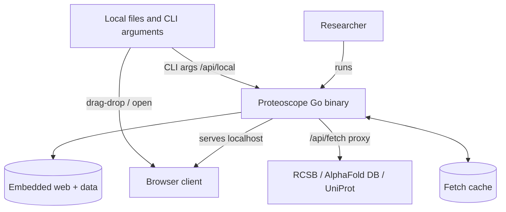
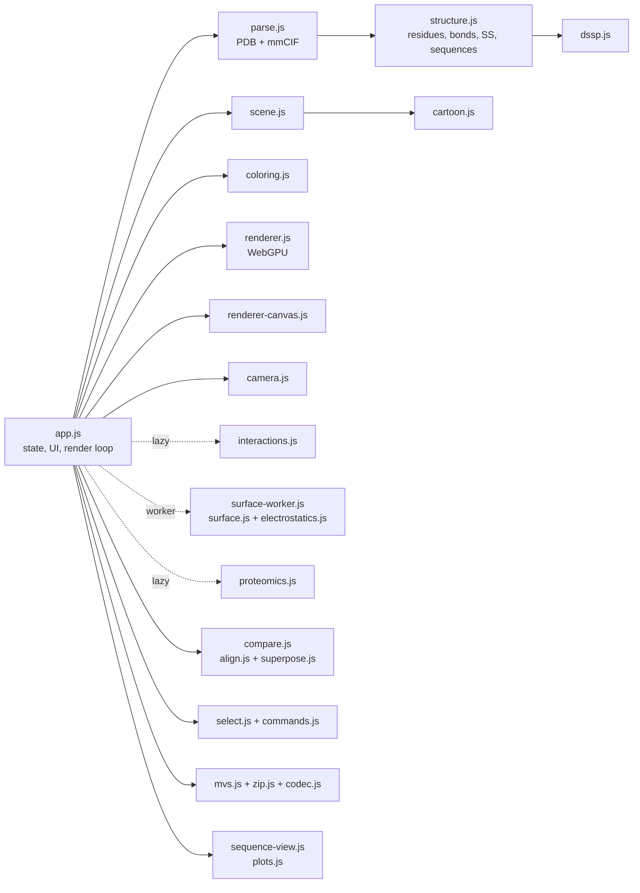
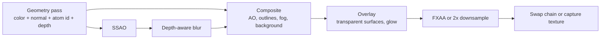

# Design Document: Proteoscope

## Overview

Proteoscope is a local molecular visualization and analysis application built
as a Go single-binary web server with an embedded browser frontend.

The backend serves static assets, the bundled structures, a sample manifest,
files named on the command line, and a small fetch proxy for public databases.
The browser frontend owns the scientific workflow:

- Parsing and structure derivation.
- Secondary structure.
- Representation and color building.
- WebGPU rendering.
- Analysis: interactions, surfaces, SASA, plots.
- Proteomics overlays.
- Export.

Key design principles:

- **Single-file distribution.** All application assets and bundled structures
  ship in one executable.
- **Local-first privacy.**
  - User files are parsed in the browser and are never uploaded.
  - Remote requests go only to fixed public databases (RCSB, AlphaFold DB,
    UniProt), through the local proxy.
  - `--offline` disables remote requests.
- **Scientific competence before spectacle.** Chemical and biological
  semantics come first: residue typing, bonds, DSSP, numbering, confidence
  and interactions. Every analysis states its method.
- **Publication-quality rendering.** Ray-cast impostors, ambient occlusion,
  outlines and supersampled export, with a canvas fallback.
- **No build step.** Plain ES modules in `web/lib/` are loaded directly by the
  browser and tested with Node's built-in test runner.

## Architecture

### System Components

```mermaid
graph TB
    User[Researcher]
    Binary[Proteoscope Go binary]
    Browser[Browser client]
    Embed[(Embedded web + data)]
    Cache[(Fetch cache)]
    Remote[RCSB / AlphaFold DB / UniProt]
    Local[Local files and CLI arguments]

    User -->|runs| Binary
    Binary -->|serves localhost| Browser
    Binary --> Embed
    Binary -->|/api/fetch proxy| Remote
    Binary <--> Cache
    Local -->|drag-drop / open| Browser
    Local -->|CLI args /api/local| Binary
```

### Browser Modules

```mermaid
graph LR
    App[app.js<br/>state, UI, render loop]
    Parse[parse.js<br/>PDB + mmCIF]
    Structure[structure.js<br/>residues, bonds, SS, sequences]
    DSSP[dssp.js]
    Cartoon[cartoon.js]
    Scene[scene.js]
    Color[coloring.js]
    Renderer[renderer.js<br/>WebGPU]
    Canvas[renderer-canvas.js]
    Camera[camera.js]
    Interactions[interactions.js]
    Surface[surface-worker.js<br/>surface.js + electrostatics.js]
    Proteomics[proteomics.js]
    Compare[compare.js<br/>align.js + superpose.js]
    Select[select.js + commands.js]
    Share[mvs.js + zip.js + codec.js]
    Views[sequence-view.js<br/>plots.js]

    App --> Parse --> Structure --> DSSP
    App --> Scene --> Cartoon
    App --> Color
    App --> Renderer
    App --> Canvas
    App --> Camera
    App -. lazy .-> Interactions
    App -. worker .-> Surface
    App -. lazy .-> Proteomics
    App --> Compare
    App --> Select
    App --> Share
    App --> Views
```

Modules in `web/lib/` are pure (no DOM access) except `renderer*.js`,
`sequence-view.js` and `plots.js`. Pure modules run in the browser, in Web
Workers and in Node tests. Interactions, proteomics and electrostatics load
lazily on first use.

## Host Application Design

### Embedded Content

`//go:embed` includes `web/index.html`, `web/styles.css`, `web/app.js`,
`web/favicon.svg`, `web/lib/*.js` and `data/`. Test files (`*.test.mjs`) are
not embedded. `--dev` serves `web/` and `data/` from disk instead.

### HTTP Routes

| Route | Purpose |
| --- | --- |
| `/` and static assets | Embedded application |
| `/api/health`, `/api/samples` | Health check and bundled-structure manifest |
| `/api/startup` | Version, offline flag and files given on the command line |
| `/api/local/{index}` | A file named on the command line (gzip decoded) |
| `/api/fetch/pdb/{id}` | RCSB PDBx/mmCIF by PDB ID, including extended `pdb_` IDs |
| `/api/fetch/afdb/{accession}` | AlphaFold DB model; the file URL comes from the prediction API |
| `/api/fetch/afdb/{accession}/pae` | AlphaFold DB PAE JSON |
| `/api/fetch/uniprot/{accession}` | UniProtKB entry with feature annotations |
| `/data/*` | Bundled structure files |

Fetch responses carry `X-Proteoscope-Filename`, `-Source`, `-Cache` and, for
AlphaFold DB, `-Pae` and `-Meta-B64` headers. Payloads are cached on disk with
atomic writes. The cache has no expiry.

### Security

- **Host check.** Requests must name a loopback host, or the `--host` value,
  in the `Host` header. This blocks DNS rebinding.
- **Cross-origin checks.** API requests with a foreign `Origin` or a
  cross-site `Sec-Fetch-Site` are rejected.
- **Headers.** HTML is served with a strict CSP (`script-src 'self'`,
  `connect-src 'self'`). All responses carry `nosniff`, `no-referrer`, COOP
  and CORP.
- **Upstreams.** Only fixed hosts, with size and time limits. Redirects are
  followed only within the same host.

## Data Model

The application state holds a list of **entries**, one per loaded structure,
and the active entry. An entry holds the structure plus everything that
belongs to it: display and color settings, surface, selection, focus, labels,
interactions, SASA, proteomics overlays, PAE, visibility, its cumulative rigid
transform, and the last superposition in which it moved (pairs, per-residue
deviation and lDDT, statistics). The per-structure fields on the state object
(`state.structure`, `state.display`, `state.selection`, …) are accessors for
the active entry, so single-structure code paths are unchanged.

A **structure** holds:

- Metadata: title, code, method, resolution, R-free, organism, deposition
  date, and whether the structure is a predicted model.
- Entities, chain→entity mapping and declared sequences (SEQRES or
  `entity_poly_seq`).
- UniProt segments, per-residue confidence (ModelCIF), component names, and
  secondary-structure ranges.
- Explicit connections, assemblies, models, chains and sequences.

A **model** holds atoms, residues, `residueMap`, `atomResidue` (atom →
residue index), bonds (`{a, b, kind}`, where kind is `covalent` or `metal`),
bounds, the B-factor range and a cartoon cache.

An **atom** carries:

- Identity: `id` (its index in the model), serial, name.
- Residue identity: `resName`, `chain`/`authChain`/`labelChain`,
  `resSeq`/`authSeq`/`labelSeq`, `iCode`, `entityId`.
- Coordinates and scalars: coordinates, occupancy, B-factor, formal charge,
  element.
- Classification: `kind` (protein, nucleic, ligand, ion or water) and
  secondary structure.

A **residue** carries:

- Its atoms and an `atomByName` map.
- Backbone atoms (protein) or nucleic backbone atoms.
- Identity and type: `kind`, `parent` (e.g. MET for MSE), a one-letter code
  and a `modified` flag.
- Chain linkage: `linkedToPrevious`, computed from peptide or phosphodiester
  geometry.
- Secondary structure: `ss`, `ssSource`, `dssp`.
- Geometry and quality: φ/ψ, mean B-factor, occupancy, confidence.

## Parsing Design

- **PDB (fixed columns).**
  - Coordinates, models, HELIX/SHEET, CONECT and SSBOND.
  - Metadata: HEADER, TITLE, COMPND, SOURCE, KEYWDS, EXPDTA, REMARK 2 and 3
    (resolution, R-free), HETNAM, SEQRES, DBREF/DBREF1/DBREF2.
  - Assemblies from REMARK 350.
  - Element inference follows the atom-name alignment convention when the
    element column is missing.
- **PDBx/mmCIF.**
  - The tokenizer follows CIF quoting rules: a quote ends a value only when
    followed by whitespace.
  - Loops are stored column-wise, so `_atom_site` is read without creating an
    object per row.
  - Only covalent, disulfide and metal-coordination `_struct_conn` records
    become bonds; hydrogen-bond records do not.
  - ModelCIF `_ma_qa_metric_local` supplies per-residue pLDDT.
- **Alternate locations.** The highest-occupancy conformer is kept
  (deterministic ties). Aliases keep CONECT serial numbers resolvable.

## Structure Derivation

- **Residue kinds.** Kinds come from name tables. Unknown residues with a
  linked peptide or sugar-phosphate backbone are promoted into the polymer.
- **Bonds.**
  - Explicit records are applied first.
  - Then a spatial hash with 2.9 Å cells finds bonds using element covalent
    radii.
  - Cross-chain bonds are allowed only for ligands and disulfides.
  - Metal–ligand pairs up to 2.8 Å become `metal` bonds.
- **Secondary structure.**
  - DSSP is always computed.
  - The *Auto* mode uses file annotations when present, otherwise DSSP.
  - C-alpha-only chains use a geometric estimate.
- **Sequences.**
  - Declared sequences are aligned to modeled residues: by `label_seq_id` for
    mmCIF, and by Needleman–Wunsch for PDB SEQRES.
  - UniProt segments map between author and UniProt numbering.

## Rendering Design

### WebGPU Frame

```mermaid
graph LR
    G[Geometry pass<br/>color + normal + atom id + depth] --> AO[SSAO] --> B[Depth-aware blur]
    G --> C[Composite<br/>AO, outlines, fog, background]
    B --> C
    C --> O[Overlay<br/>transparent surfaces, glow]
    O --> F[FXAA or 2x downsample]
    F --> S[Swap chain or capture texture]
```

- **Spheres.** Camera-facing quads sized to the perspective silhouette. The
  fragment shader ray-casts the sphere, writes `frag_depth`, and caps spheres
  cut by the front clip plane.
- **Cylinders.** Oriented bounding-box proxies, ray-cast in the fragment
  shader. They use split colors and pick the atom at the nearer end. Optional
  dashes and round caps support measurement, interaction and cross-link
  lines.
- **Meshes.** Cartoon and surfaces are indexed triangle lists with smooth
  normals. The per-vertex atom index looks up the atom's color and
  selection flags, so recoloring and selection never rebuild geometry.
- **Per-atom buffers.** Color and flags (selected, hovered, dimmed) are
  storage buffers indexed by atom ID. Several structures share them: every
  rendered model (the active model of each entry, or all models of an
  overlaid ensemble) gets a contiguous slice. Sphere and cylinder instances
  carry global indices; cartoon and surface meshes keep local indices and a
  per-mesh atom-offset uniform, so moving a slice never re-uploads a mesh.
- **Depth.** Reversed-Z on `depth32float`.
- **Clipping.** Front and back view-depth planes are applied in the shaders.
- **Transparency.** Transparent surfaces use a depth pre-pass followed by a
  single-layer blend.
- **Picking.** The atom-ID target is copied into a 9×9 readback window, and
  the hit nearest the cursor is used.
- **Capture.** Off-screen targets are rendered at 2× and downsampled with
  premultiplied alpha, then un-premultiplied on the CPU. Transparent
  backgrounds are supported.
- **On-demand rendering.** A frame is drawn only when the scene, camera,
  colors or flags change, or while an animation runs.

### Canvas Fallback

The Canvas 2D fallback consumes the same instance buffers and cartoon polyline
shapes. It sorts them by depth and applies depth cueing. It draws no surfaces,
ambient occlusion or outlines.

### Representations

- **Scene building.** Each atom gets a style from its component: polymer
  (cartoon, trace, ball-and-stick, sticks, spacefill or hidden), ligand, ion
  or water. Side chains are drawn around the focus or everywhere.
- **Cartoon coverage.** Residues outside the cartoon, such as isolated
  residues, fall back to ball-and-stick so nothing disappears.
- **Cartoon geometry.**
  - Catmull–Rom splines through C-alpha atoms. Sheet control points are
    smoothed.
  - Ribbon orientation comes from carbonyl guide vectors.
  - The cross-section is a superellipse whose width, thickness and exponent
    morph per sample: ellipse helices, flat sheets and round coils.
  - Arrowheads use a step face.
  - Nucleic acids get a phosphate-trace tube, base-ring slabs and
    glycosidic connectors.

## Comparison Design

- **Residue pairing** (`align.js`, `compare.js`).
  - Gotoh global alignment with affine gaps and free end gaps. Protein scores
    blend BLOSUM62 with a secondary-structure matrix (30% weight; helix and
    strand gap opening 18, otherwise 6; extension 1), as in ChimeraX
    matchmaker. Nucleic acids use identity scoring with T equal to U.
  - Chains are paired by alignment score. Several near-top chain pairs seed
    candidate pairings; each extends to the other chains by nearest centroid
    after the seed fit, and the pairing whose fit keeps the most residues
    wins, with matching chain IDs as the tie-breaker.
  - Alternatives: UniProt numbering (SIFTS/DBREF segments against AlphaFold DB
    numbering) and shared residue keys (models of one ensemble).
- **Fitting** (`superpose.js`).
  - Horn's closed-form quaternion solution on Cα (protein) or C4′ (nucleic
    acid) atoms; the quaternion form cannot produce a reflection.
  - Iterative pruning as in ChimeraX: each cycle removes the lesser of 10% of
    the remaining pairs and half of those beyond 2 Å, until none are beyond.
  - Candidate fits on all chains and on each chain pair are scored by how
    many pairs they bring within 2 Å.
- **Scores.** RMSD (core and all pairs); TM-score maximized with the TM-score
  program's search (fragment seeds of decreasing length, refit on pairs
  closer than d0_search), normalized by the reference length; lDDT over
  paired principal atoms (15 Å inclusion radius, thresholds 0.5, 1, 2 and
  4 Å); per-chain RMSD and TM-score; RMSF about the mean for ensembles.
- **Moving structures.** Superposition rewrites the moving entry's atom
  coordinates and composes its cumulative transform, so every downstream
  feature (cartoon, surfaces, labels, measurements, picking) needs no special
  case. **Reset positions** applies the inverse. Assembly operators are defined
  in the deposited frame, so changing an assembly first undoes the transform.
- **Correspondence.** Residue-key maps between entries (direct, or through a
  shared reference) drive mirrored selection, hover and focus, deviation and
  lDDT coloring of both structures, and the aligned sequence row.

## Selections, Commands and Sessions

- **Selections** (`select.js`) parse to an AST (keywords, ChimeraX atom specs,
  Boolean logic with implicit AND) and evaluate to one atom mask per
  structure. Predicates compile once per structure; `within`/`around` use a
  spatial hash over the reference atoms of every structure; per-residue values
  (deviation, lDDT, RMSF, relative SASA) and sets (selection, focus, sites)
  come from a context the app supplies, so the module stays pure.
- **Commands** (`commands.js`) only parse; `runCommand` in the app executes
  them and returns `{ ok, message, data }`, which serves the search box, the
  console API and the remote-control API alike. Plain selections run as
  `select`.
- **Per-residue styling** lives in each entry's display settings: extra
  representations (`residueStyles`), hidden residues, and a surface residue
  set; color overrides merge with proteomics site colors. On a cartoon, sticks
  show the side chain anchored at Cα.
- **Sessions** serialize each entry's source and settings, not its derived
  data: structures are fetched or decompressed again, transforms reapplied,
  comparisons refitted from their recorded recipe (which then yields a
  near-identity fit), and residue-keyed state restored. Links deflate the same
  JSON into `#session=`.
- **MolViewSpec** export builds a Mol* node tree from the scene: one
  `download → parse → structure (→ transform) → component → representation →
  color` branch per structure, with colors read from the live atom colors and
  grouped into residue ranges or per-element selectors.
- **Remote control** (`remote.go`) relays commands from
  `POST /api/remote/command` to the newest page over Server-Sent Events and
  returns the page's posted result, with a timeout.

## Interaction Design

- **Camera.**
  - A quaternion trackball orbits about the camera axes; there is no gimbal
    lock.
  - Pan, roll and pinch-zoom are supported.
  - New structures are framed on their principal axes. The long axis runs
    horizontal on landscape screens and vertical on portrait screens.
  - A projection offset centers the molecule in the area not covered by the
    side panels.
  - Transitions are animated.
- **Selection.** Selection works on residues. Click selects,
  shift/meta-click toggles, and the sequence panel supports drag ranges.
  Hover highlighting is synchronized between 3D and the sequence panel.
- **Focus.** Focusing selects the residues within 5 Å of the target (a
  spatial-hash search), shows their side chains, computes PLIP-style
  interactions and frames the site.
- **Measurements.** Distance, angle and torsion modes collect atoms by
  clicking. Lines are dashed cylinders, and values appear as HTML labels
  projected every frame.

## UI Design

The canvas fills the window, and panels float over it.

- **Top bar.**
- **Left panel.** Tabs for Structure, Style, Analysis and Proteomics.
- **Right panel.** Chains, selection, interactions and measurements.
- **Bottom.** The sequence panel.
- **Viewport overlays.** Toolbar, legend, mode banner, model strip, labels
  and tooltip.
- **Dialogs.** Export and help.
- **Performance.** Plots in hidden tabs are not re-rendered.
- **Narrow screens.** Panels become exclusive overlays.

## Error Handling

- Parse and fetch errors appear as toasts. Proxy errors are returned as JSON
  with a readable message.
- WebGPU absence or timeout triggers the Canvas fallback, and the badge
  explains the limitations. A lost GPU device shows a reload message.
- A lazily loaded module that fails is reported once, and its features are
  disabled.
- Assemblies above 300,000 atoms per model are disabled in the selector.

## Known Limitations

See `roadmap.md` §7. In particular:

- Superposition needs sequence (or UniProt) correspondence; there is no
  structure-only alignment yet.
- Electrostatics are qualitative (formal charges, ε = 4r).
- Ligand chemistry is inferred from geometry.
- The Ramachandran regions are approximate.
